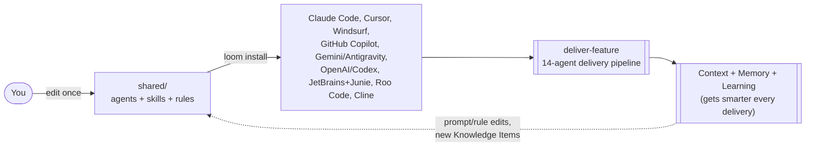
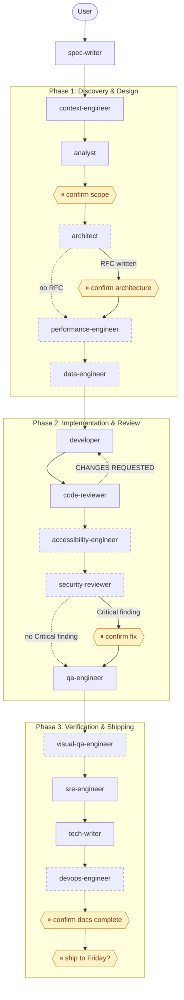

# Loom — Context Engineering Framework

[](https://github.com/orieken/loom/actions/workflows/framework-ci.yml)

```bash
brew install orieken/tap/loom
loom install
```

One canonical set of agents, skills, and rules — written once in `shared/`, installed via the **loom** CLI
into whatever AI coding tool you actually use (Claude Code, Cursor, Windsurf, GitHub Copilot, Gemini Antigravity,
OpenAI/Codex, JetBrains AI Assistant + Junie, Roo Code, Cline). Edit `shared/`, run `loom install`, every tool stays in sync — no more hand-copying the same
instructions into five different config formats.

This also ships a full multi-agent **feature delivery pipeline** (spec → analysis → architecture →
implementation → review → security → QA → docs → deploy) built around Clean Architecture, TDD, and the
craftsmanship principles of Robert C. Martin, Martin Fowler, Kent Beck, and Neal Ford.

For deeper detail beyond this README:
- [docs/ARCHITECTURE.md](docs/ARCHITECTURE.md) — the `shared/` layer design, tier system, context flow
- [docs/AGENT_REFERENCE.md](docs/AGENT_REFERENCE.md) — every agent's role and what actually checks its work today
- [docs/CONTRIBUTING.md](docs/CONTRIBUTING.md) — how to add a new agent, skill, rule, or platform
- [docs/runbooks/](docs/runbooks/) — operational guides, including adding a platform and editing agent prompts
- [docs/MIGRATION.md](docs/MIGRATION.md) — upgrading a pre-restructure ("v1") checkout to the canonical `shared/` layer ("v2")

---

## The Framework at a Glance



One canonical source, nine tools kept in sync automatically, one governed pipeline, and a feedback loop that
improves the framework itself over time — see [context-engineering.md](docs/runbooks/context-engineering.md)
for how the Context/Memory/Learning loop actually works, and the pipeline diagram further down for the full
14-agent sequence.

---

## Architecture (Shared Layer → Platform Configs → Project Install)

```
shared/                              <- single source of truth, edit here only
├── agents/        (39 agents)       <- .md with YAML frontmatter, versioned (CHANGELOG.md)
├── skills/        (69 skills)       <- .md with trigger keywords/patterns
├── rules/                           <- architecture-guardrails.md, design-principles.md, approval-gates.md
├── contracts/                       <- required-section contracts for pipeline agent handoffs
├── knowledge/                       <- portable Knowledge Items (KIs)
├── templates/                       <- tutorial/scaffold content, e.g. my-first-feature.md
├── ARCHITECTURE_RULES.md
├── DOMAIN_DICTIONARY.md
├── TEAM_TOPOLOGY.md               <- Bounded Context -> team/type/interaction-mode registry (Skelton & Pais)
├── memory-registry.json           <- catalog of every durable memory source + retrieval backend
├── platform-registry.json           <- tier/capability/format per platform
├── mcp/                             <- MCP server scaffold (6 M1 tools, stdio transport, Go)
└── mcp-patterns/                    <- porting guides for non-Go MCP servers (Go: import register.Frameworks)

        │  scripts/generate-configs.sh (reads shared/ + platform-registry.json)
        ▼

Generated / symlinked platform configs (this repo, or any target project via loom install)
├── .claude/{agents,rules,skills}/    -> symlinks to shared/ (Tier 1: Full)
├── .cursor/rules/*.mdc               <- generated, rules inlined (Tier 2: Personas + Rules)
├── .windsurfrules                    <- generated, flat (Tier 2)
├── .github/copilot-instructions.md   <- generated (Tier 2), + .github/instructions/*.instructions.md
├── AGENTS.md                          <- generated (confirmed read by Gemini Antigravity)
├── .agents/{skills,rules}/            <- symlinks to shared/ (project installs; ~/.gemini/config/skills/ for --global)
└── .openai.md                        <- generated (Tier 3)

        │  loom install --global | --target <path>
        ▼

Your machine (~/) or a target project — agents/skills/rules active in every AI tool you use
```

`loom health` verifies every installed config matches the canonical `shared/` source and checks for symlink
drift, frontmatter schema errors, and missing entries. `scripts/check-parity.sh` does the same check as a
raw shell script — useful during framework development or on CI where loom isn't installed.

---

## Quick Start

**Recommended — builds from source, no macOS Gatekeeper warning:**

```bash
go install github.com/orieken/loom/cmd/loom@latest
```

Requires Go 1.21+. The binary lands in `~/go/bin/` — make sure that's on your `PATH`.

**Homebrew (installs a pre-built binary):**

```bash
brew install orieken/tap/loom
```

> **macOS note:** pre-built binaries trigger Gatekeeper on first run. Clear it once with:
> `xattr -d com.apple.quarantine $(which loom)`

**Or download a release archive directly** from [github.com/orieken/loom/releases](https://github.com/orieken/loom/releases) — binary archives and a source tarball are published for every release.

---

Once `loom` is installed:

```bash
# Preview what would happen without writing anything
loom install --dry-run

# Install into the current project (auto-detects which AI platforms you have)
loom install

# Install into a specific project
loom install --target /path/to/your-project

# Force a single platform
loom install --platform claude

# Copy files instead of symlinks (required on Windows without WSL)
loom install --copy

# Verify everything is healthy
loom health

# Serve the six framework MCP tools over stdio (register with: claude mcp add loom -- loom mcp serve)
loom mcp serve

# Execute the delivery pipeline for a spec, halting at each approval gate
loom run --spec docs/features/user-auth/spec.md
loom run --spec docs/features/user-auth/spec.md --resume --approve confirm-design

# Record and verify markdown-pipeline checkpoints (digests computed in Go, never by a model)
loom state record --spec docs/features/user-auth/spec.md --stage analyst --artifact .claude/feature-workspace/user-auth/analysis.md
loom state verify --spec docs/features/user-auth/spec.md
```

`loom run` and `loom state` are documented in full in
[cmd/loom/README.md](cmd/loom/README.md) — approval gates, state integrity, typed
pipeline state, and the run event timeline.

`loom install` auto-detects which AI platforms you have installed and only writes configs for those.
Pass `--platform <name>` to target one specifically. Files are **symlinked by default** so a `git pull`
on the source repo is all you need to stay current. Pass `--copy` for a self-contained install that
doesn't depend on the repo checkout remaining in place.

### Maturity-level install profiles (`--level`)

`loom install --level N` (alias: `loom init --level N`) installs a curated bundle for an agentic
maturity level instead of everything. Levels are cumulative and data-driven from
[`shared/levels.yaml`](shared/levels.yaml); a bundle whose implementation hasn't landed yet is
skipped with a warning naming the roadmap item it waits on. **Omitting `--level` keeps the historic
full install unchanged.**

| Level | Name | What it installs |
|---|---|---|
| **1** | Foundational prompts | The 5 core rules (guardrails, approval gates, design principles, memory trust boundary, testing), all agents + skills, project base files. Core rules stay under the context ceiling recorded in `levels.yaml` (~5.6k tokens, test-enforced) |
| **2** | Coordinated multi-agent | Level 1 + `.mcp.json` registering `loom mcp serve` (written only if absent) + workflow and orchestration definitions under `.claude/` |
| **3** | Observed and governed | Level 2 + hooks docs. Telemetry is real for `loom run` — an event timeline with a generated vocabulary, plus OTel traces with per-stage token counts and cost — while the hook executor (L3.10) and the policy engine (L2.16) are gated on unlanded roadmap items |
| **4** | Self-improving | Level 3 + evaluation corpus; the live evaluation loop is gated on unlanded roadmap items today |

Language and IaC conventions are **on-demand modules**, not part of any level bundle — opt in per
project with `--stack`:

```bash
# Level 1 core plus the Go and IaC rule modules
loom install --level 1 --stack go,iac
```

To find out where a project sits on the ladder, run `loom health`: it reports the highest level
whose mechanical evidence fully passes (installed bundles, an MCP server that actually answers
`tools/list`, a live telemetry stream) plus a concrete gap checklist for the next level.
Documentation presence never confers a level — see the "Maturity level report" section in
[`cmd/loom/README.md`](cmd/loom/README.md).

**No Go? Clone and run with the legacy shell script (still works):**

```bash
git clone https://github.com/orieken/loom
cd loom
./install.sh --global
```

Once installed:
```bash
# Claude Code: agents are native subagents, skills are slash commands
claude
> /new-feature "password reset via email"       # interview + spec
> /deliver-feature features/password-reset.md   # full pipeline

# Any other tool: agents are personas, invoke by @-tagging or referencing the file
> Act as the code-reviewer persona from shared/agents/code-reviewer.md and review my current changes.
```

**Version marker** — every non-dry-run install writes `.claude/framework-install.json` into the
target. It records the installed git tag, commit SHA, install date, mode (symlink/copy), and
framework level. `loom health` reads this marker and reports a WARN if the source repo has moved
ahead — making drift from `--copy` installs visible without manual archaeology. Pre-v3.3 installs
have no marker; the legacy forensic detection in `docs/prompts/update-installed-framework.md`
remains the fallback.

To remove: `loom uninstall` (or `loom uninstall --target <path>`) restores whatever was backed up during install and removes the version marker.

---

## Enterprise Memory Sync

Teams using this framework across multiple repositories can share Knowledge Items (KIs) via an organization-owned `knowledge-hub` git repo. See [ADR-003](docs/adrs/ADR-003-enterprise-memory-sync.md) for the full design rationale.

**Setup** — create `.claude/sync-config.yaml` at the root of your framework checkout:

```yaml
memory_sync:
  org_repo: git@github.com:<your-org>/knowledge-hub.git
  cache_dir: ~/.claude/sync-cache
  push_pr_base: main
```

**Pull** — diff org KIs into your local `shared/knowledge/` (dry run first, then apply):

```bash
# Memory sync runs via the shell script (not yet in loom install)
./install.sh --sync-memory               # preview changes
./install.sh --sync-memory pull --confirm  # apply
```

**Push** — promote mature `.claude/knowledge/` KIs (>30 days old) to the org repo via PR:

```bash
./install.sh --sync-memory push             # preview candidates
./install.sh --sync-memory push --confirm   # open PR (requires gh CLI for GitHub)
```

**Conflict rules**: `shared/knowledge/` → org repo wins on pull. `.claude/knowledge/` → local always wins (project KIs are never overwritten). Name collisions between org and project KIs halt the pull until resolved manually.

**Auth**: SSH is primary. For enterprises where SSH is disabled, set `MEMORY_SYNC_TOKEN=<pat>` in the environment — the script converts the SSH URL to HTTPS automatically.

---

## Platform Capability Matrix

| Platform | Tier | Capability | Format | Terminology |
|---|---|---|---|---|
| **Claude Code** | 1 — Full | Agents (tool access, autonomous process, pipeline participation), skills, rules, hooks, subagent orchestration | Markdown + YAML frontmatter, symlinked from `shared/` | Agent |
| **Cursor** | 2 for rules; agents/skills now Tier-1-equivalent (confirmed 2026-07-06) | Real subagent + skill loading via `.cursor/agents/`/`.cursor/skills/` (symlinked to `shared/`, zero-drift, same mechanism as Claude Code) — no `tools:` allowlist though, subagents inherit all parent tools with only a coarse `readonly` flag. Rules still fully inlined, no orchestration at that layer | `.cursor/agents/`, `.cursor/skills/` — direct symlinks to `shared/`. Rules: `.mdc` per concern (11: `architecture`, `design-principles`, `approval-gates`, `agent-roster`, `testing`, `go-backend`, `vue-frontend`, `typescript-conventions`, `python-conventions`, `csharp-conventions`, `java-conventions`), YAML frontmatter, content inlined (Cursor Rules still can't follow file references). Only `approval-gates.mdc`/`agent-roster.mdc` are `alwaysApply`; the rest Auto Attach on relevant file globs to stay near Cursor's own ~2,000-token always-apply budget | Agent (`.cursor/agents/`) / Persona (`.cursor/rules/`) |
| **Windsurf** | 2 — Personas + Rules | Same as Cursor | Single flat `.windsurfrules`, inlined | Persona |
| **GitHub Copilot** | 2 — Personas + Rules | Repo-wide instructions + path-scoped rule files (confirmed via [GitHub's docs](https://docs.github.com/en/copilot/how-tos/configure-custom-instructions-in-your-ide/add-repository-instructions-in-your-ide), 2026-07) | `.github/copilot-instructions.md` (roster + rules inlined) **plus** 7 scoped `.github/instructions/*.instructions.md` files (`testing`, `go-backend`, `vue-frontend`, `typescript-conventions`, `python-conventions`, `csharp-conventions`, `java-conventions`) with `applyTo` globs — all combine | Persona |
| **JetBrains AI Assistant + Junie** | 2 — Personas + Rules | Project-rules with IDE-configurable scoping (Always / By file patterns / By model decision / Manually). Junie (agentic mode) reads `.junie/guidelines.md` first, then falls back to root `AGENTS.md` (already generated). No custom modes or skill invocation. Files travel with the project — works in IntelliJ IDEA, WebStorm, Rider, etc. Confirmed via jetbrains.com/help/ai-assistant and junie.jetbrains.com/docs (2026-07-30) | `.aiassistant/rules/` (10 files: 4 always-active, 6 with IDE mode hint for file-pattern scoping) + `.junie/guidelines.md` — generated by `loom install --platform jetbrains` | Persona |
| **Roo Code** | 2 — Personas + Modes | All 40 shared agents map to Roo Code custom modes with per-mode tool access scoping (`read`, `edit`, `command`, `mcp`, `browser` groups derived from agent `tools:` field). Global framework rules in `.roo/rules/` apply to all modes. No skill invocation, no pipeline orchestration. Confirmed format via docs.roocode.com (2026-07-30) | `.roomodes` (YAML, 40 custom modes) + `.roo/rules/*.md` — generated by `loom install --platform roo-code` | Mode (agent-like persona with tool scoping) |
| **Cline** | 2 — Personas + Rules | Plain markdown rules directory; optional `paths:` frontmatter for file-scoped activation. No custom modes or agent equivalent. Also reads `~/.agents/AGENTS.md` (cross-tool convention) | `.clinerules/` (10 files: 4 always-active, 6 path-scoped by language/test) — generated by `loom install --platform cline` | Persona |
| **Gemini (Antigravity)** | 3 (rules) + confirmed real skill invocation | **Confirmed 2026-07-02** ([results](tests/platform-verification/results/)): reads `AGENTS.md` for rules, genuinely invokes (not just describes) skills from `.gemini/config/skills/` (global) or `.agents/skills/` (project). The old `.gemini/antigravity/instructions.md` guess was confirmed unread and removed | `AGENTS.md`, `~/.gemini/config/skills/` (global) or `.agents/skills/`/`.agents/rules/` (project), symlinked to `shared/` | Persona |
| **OpenAI / Codex** | 3 — System Prompt | Single instruction file only | `.openai.md`, inlined | Persona |

Full definitions of **Agent**, **Persona**, and **Capability Tier** live in `DOMAIN_DICTIONARY.md`. The
short version: only Tier 1 has real multi-step agent orchestration with tool access; Tiers 2/3 get the same
underlying knowledge as a **persona** — a context frame with no autonomous pipeline participation — because
that's what those tools are actually capable of running.

---

## Agent Roster (39)

Full definitions in `shared/agents/`; versions tracked in `shared/agents/CHANGELOG.md`. For what actually
checks each agent's work today (a contract, a downstream reviewer, a human approval gate, or an honestly
documented gap), see [docs/AGENT_REFERENCE.md](docs/AGENT_REFERENCE.md).

| Agent | What it does |
|---|---|
| **spec-writer** | Interviews the user to build a complete feature spec, critiques its own readiness before it enters the pipeline. |
| **product-owner** | Challenges scope and ROI before any code is written — maximizes work *not* done. |
| **context-engineer** | Pre-flight context optimizer: scopes the bounded context, pins files, surfaces KIs/ADRs, estimates token budget, auto-prunes out-of-context files. |
| **analyst** | First pipeline step. Turns a feature spec into acceptance criteria, task breakdown, data model/API changes, and a definition of done. |
| **architect** | Structural decisions, fitness functions, layer boundaries — for features that need them. Writes RFCs for boundary-crossing changes. |
| **performance-engineer** | Shift-left performance review of the architecture before implementation starts — N+1 prevention, timeouts, caching. |
| **data-engineer** | Schema design and zero-downtime (Expand/Contract) migrations for features touching the database. |
| **developer** | Implements the feature via TDD, runs in an isolated worktree, iterates with code-reviewer until approved. |
| **code-reviewer** | Reviews for SOLID/clean-code violations; sends work back with named refactoring instructions until approved. |
| **accessibility-engineer** | Reviews UI changes for semantic HTML and WCAG compliance before code-review passes to security. |
| **security-reviewer** | STRIDE threat model of the implementation; fixes Critical/High findings directly rather than just recommending. |
| **qa-engineer** | Writes and runs tests covering every acceptance criterion and edge case; fixes bugs it finds. |
| **sre-engineer** | Observability review — SLIs, OTel spans, structured logging, PII hygiene. |
| **tech-writer** | Updates all documentation for the delivered feature. |
| **devops-engineer** | CI/CD, environment config, deployment — the final pipeline agent. |
| **dependency-auditor** | Audits the dependency tree for vulnerabilities, license issues, and unused packages. |
| **release-manager** | Semantic version bump, changelog, and deployment checklist from git history. |
| **chaos-engineer** | Designs fault-injection experiments to verify resilience patterns actually work. |
| **dx-engineer** | Developer-experience: build times, flaky tests, local dev loop friction. |
| **finops-engineer** | Reviews architecture/code changes for cost implications as a first-class metric. |
| **documentation-manager** | Ad-hoc-session counterpart to `promote-memory` -- captures durable knowledge from sessions that never went through `deliver-feature`, via the same Candidate Record + human-approval flow. |
| **memory-auditor** | Read-only counter-agent for the KI corpus — audits schema compliance, duplicate candidates, and stale metadata without modifying memory. |
| **modernization-supervisor** | Coordinates parallel legacy-modernization workstreams (dependencies, patterns, test coverage). |
| **api-test-generator** | Generates Sunday Framework API test suites (Playwright + Vitest + Zod) from a spec. |
| **unit-tester** | Backfills unit and characterization tests for existing code without modifying production implementation. |
| **refactor-engineer** | Large-scale structural refactoring: builds characterization-test safety net, applies named Fowler operations, verifies behavior preservation. Never adds behavior in the same run. |
| **visual-qa-engineer** | Analyzes interaction heatmaps and Playwright screenshot baselines for visual regression after qa-engineer. |
| **agent-evaluator** | Read-only counter agent — runs golden-file evaluations against agent frontmatter contracts and prompt behavior expectations. |
| **context-auditor** | Read-only counter to context-engineer — audits context-manifest.md for pruning discipline, broken KI/ADR links, and budget accuracy. |
| **documentation-auditor** | Read-only counter to tech-writer — audits README, AGENT_REFERENCE, and prose docs for staleness against current inventories. |
| **knowledge-auditor** | Read-only counter to create-ki — audits new KIs for schema compliance, semantic duplication, and domain dictionary alignment. |
| **model-tier-auditor** | Read-only counter to agent authors — audits agent frontmatter for portable `model_tier` declarations. |
| **pattern-reviewer** | Read-only counter to pattern document authors — audits `docs/patterns/*.md` for accuracy against current codebase state. |
| **privacy-auditor** | Read-only counter to security-reviewer — audits pipeline artifacts for accidental PII inclusion and data boundary leaks. |
| **prompt-evaluator** | Read-only counter to prompt authors — audits agent and skill prompt files for fabricated URLs, hardcoded secrets, and template hygiene. |
| **retrieval-evaluator** | Read-only counter to retrieval skills — audits KI/ADR corpus retrievability and runs the approved regression set. |
| **rule-auditor** | Read-only counter to rule authors — audits `shared/rules/*.md` for contradictory constraints, dead paths, and un-indexed files. |
| **tool-validator** | Read-only counter to skill authors — audits `shared/skills/*/SKILL.md` for standalone-mode declarations and schema compliance. |

---

## Skill Catalog (69)

Full definitions in `shared/skills/<name>/SKILL.md`, including exact trigger keywords/intent patterns.
Grouped by what they're for:

### Pipeline orchestration
| Skill | Trigger on |
|---|---|
| `deliver-feature` | "Deliver \*", "Implement \*", `/deliver-feature *` — runs the full agent sequence |
| `deliver-bugfix` | "Fix bug \*", `/deliver-bugfix *` — lightweight 5-phase pipeline: reproduce-first (characterization test), developer fix, code-reviewer, QA verify. Escalates to `deliver-feature` when scope expands. |
| `deliver-atdd` | Acceptance-test-first delivery loop with scenario review gates and autonomous red-green implementation. |
| `resume-pipeline` | Resuming an interrupted run, `--from-phase N`, rolling back an agent's artifact |
| `validate-artifact` | Auto-invoked between every contract-bound agent handoff — checks required sections |
| `pipeline-trace` | "How long did \* take", ad-hoc single-run timing/iteration questions |
| `pipeline-retrospective` | Cross-delivery trend analysis — is an agent getting slower or more retried over time |
| `agent-scorecard` | Monthly quality scoring per agent (security TPR, first-pass acceptance, completeness, fitness coverage) |
| `agent-eval` | Acts as an agent against its `tests/agents/` fixture and grades the output against a qualitative rubric — the automated, LLM-as-judge half of prompt regression testing |
| `retrospective` | "How did \* go?" — single-delivery narrative, auto-invoked every 5th delivery |
| `extract-lessons` | Cross-delivery pattern extraction — recurring findings that should become rules/prompt changes/KIs |
| `context-audit` | Context waste analysis — unused pins, duplicates, unconstrained large reads |
| `summarize-artifact` | Condensing an older *untyped* pipeline artifact, or writing the retrieval surrogate (context decay) |
| `search-ki` / `create-ki` | Searching/authoring Knowledge Items in `shared/knowledge/` |
| `search-ki-semantic` | Semantic KI/ADR search using LLM-as-retriever (AOS Phase 3) — catches paraphrases and conceptual matches that lexical search-ki misses |
| `query-memory` | Registry-aware search across *every* memory source (KIs/ADRs plus feature archive, glossary, topology), not just KIs/ADRs |
| `memory-engineer` | Periodic sweep of the KI corpus for duplicates and expiration candidates; keeps `shared/memory-registry.json` accurate |
| `memory-compression` | Deduplicates, consolidates, and summarizes stale KIs — opposing-force pair with `memory-expansion` |
| `memory-expansion` | Promotes recurring lessons and delivery retrospectives into portable KIs — opposing-force pair with `memory-compression` |
| `promote-memory` | Evaluates one delivery's `retrospective.md` immediately for promotion-worthy content — KI, ADR, rule change, or lesson |
| `learning-engine` | Extracts candidate lessons from past pipeline retrospectives — opposing-force pair with `forgetting-engine` (opt-in hook) |
| `forgetting-engine` | Flags obsolete KIs and audits the capability inventory for duplicate skills and keyword collisions — opposing-force pair with `learning-engine` |
| `orchestrate` | AOS Phase 3 entry point: reads a Workflow definition and steps through its stages as prompt instructions the host LLM follows. Today "parallel" branches run sequentially and checkpointing is prompt-discipline, not a runtime guarantee — the real executor shipped with M0.4 and now owns gates, state integrity, and typed handoffs under `loom run`; parallelism is still ahead with L3.3 |
| `scheduler` | Scheduled or hook-driven pipeline runs (cron triggers, automated memory audits, periodic health checks) — specified; the hook executor that would run these deterministically ships with L3.10 |

### Feature lifecycle
| Skill | Trigger on |
|---|---|
| `onboard` | "I'm new here", "give me a tour", `/onboard` — new-user walkthrough, ends at `shared/templates/my-first-feature.md` |
| `new-feature` | Guided spec creation, optionally kicks off delivery |
| `spec-writer` | `/spec-writer`, "write a spec for \*", "review this spec" |
| `event-storm` | Collaborative domain modeling before a feature starts |
| `bootstrap-project` | Guided greenfield project setup from known ecosystem blueprints and starter artifacts. |
| `ship-feature` | Automates branch creation, Conventional Commit assembly, PR compilation, and optional release tagging — with human approval gates at every irreversible step |

### Code quality & architecture
| Skill | Trigger on |
|---|---|
| `analyze-complexity` / `complexity-check` | Cyclomatic complexity / function length audits |
| `design-review` | Standalone design critique of any file |
| `refactor-to-pattern` | Rewriting procedural code into a named GoF/Enterprise pattern |
| `check-ubiquitous-language` | Flags synonym drift against `DOMAIN_DICTIONARY.md` |
| `verify-dependencies` | Clean Architecture import-boundary checks |
| `team-topology-check` | Flags a stale Collaboration mode or a bypassed Platform team at a Bounded Context crossing, per `TEAM_TOPOLOGY.md` |
| `review-pr` | Coordinates code-reviewer + security-reviewer + accessibility-engineer on a PR |
| `context-engineer` | Builds a high-signal context manifest before complex, unfamiliar, or multi-file work. |
| `cost-optimizer` | Recommends model and agent cost optimizations when quality metrics permit — opposing-force pair with `quality-optimizer` |
| `quality-optimizer` | Identifies pipeline stages with retry/degradation and recommends higher-fidelity models — opposing-force pair with `cost-optimizer` |

### Testing
| Skill | Trigger on |
|---|---|
| `run-tests` | Executes the suite, verifies the 85% coverage threshold |
| `generate-fuzz-tests` | Property-based fuzz test generation |
| `sunday-test-advisor` | Audits an API spec for missing test scenarios |
| `saturday-test-advisor` | Audits Saturday Site-Centric E2E/UI suites for orphaned primitives and broken scenario references. |
| `debug-tests` | Iteratively debugging a failing test suite |
| `api-contract-verify` | Pact-style consumer-driven contract verification |
| `backfill-unit-tests` | Coordinates `unit-tester` and `code-reviewer` to add tests around existing code safely. |

### Security & accessibility
| Skill | Trigger on |
|---|---|
| `check-accessibility` | Semantic HTML / a11y violation scan |
| `threat-model` | STRIDE + Data Flow Diagram before development starts |

### Data & migrations
| Skill | Trigger on |
|---|---|
| `db-migration` | Zero-downtime Expand/Contract migration design |
| `validate-migrations` | Rejects destructive migration operations |

### API design
| Skill | Trigger on |
|---|---|
| `openapi` | API contract design before implementation |
| `api-ingest` | Generates docs + typed clients from a Swagger/OpenAPI URL |
| `mcp-add` | Retrofitting or extending an MCP server with the framework's tool/persona/workflow pattern. |

### Documentation
| Skill | Trigger on |
|---|---|
| `adr` / `badr` | Architecture Decision Records (technical / business-case) |
| `scaffold-docs` | Comprehensive implementation guide generation |

### Operations & incident response
| Skill | Trigger on |
|---|---|
| `on-call` | Active incident response |
| `five-whys` | Structured root cause analysis |
| `chaos-experiment` | Game Day fault injection design |
| `health-check` | Validates this installation — symlinks, frontmatter, config drift (also: `loom health`) |
| `debug-environment` | Systematic environment/config debugging |
| `performance-profile` | Diagnosing *why* something is slow |
| `dependency-update` | Safe, structured monorepo dependency updates |

### Domain-specific / utility
| Skill | Trigger on |
|---|---|
| `numpath-alignment` / `numpath-strategy` | NumPath research-project theoretical grounding checks |
| `list-agents` | Lists configured custom agents in `.claude/` |

---

## AI Feature Team Pipeline



`spec-writer` runs *before* the pipeline — it acts on the spec, not on the feature workspace, and the
delivery plan does not invoke it. The fourteen stages from `context-engineer` onward are the pipeline
proper (see `docs/AGENT_REFERENCE.md`, "What counts as a pipeline agent").

Dashed-border agents (`architect`, `performance-engineer`, `data-engineer`, `accessibility-engineer`,
`security-reviewer`, `visual-qa-engineer`, `devops-engineer`) are **conditional** — each runs only if its
own trigger condition is met: a context crossing or migration or new dependency or performance threshold
for the architect, a measurable threshold for performance, a schema change for data, an accessibility
requirement for a11y, a security surface for the security review, UI evidence for visual QA, and DevOps
tasks for devops. Skipped otherwise, straight through to the next mandatory step. Under `loom run` those
conditions are computed once from the typed analysis and recorded with reasons (roadmap L3.0); in the
markdown pipeline they are judgements the model makes while reading `analysis.md`. Amber nodes are **real
stops** — the pipeline doesn't proceed past one without your explicit confirmation. Every arrow is also
gated by `validate-artifact` (structural contract check) where the producing agent has a contract in
`shared/contracts/`.

An honest caveat on enforcement: today this entire pipeline runs as prompt instructions the host
platform's LLM follows — the stops, the contract gates, and the checkpoint files
(`.claude/feature-workspace/<feature>/pipeline-state.json` + `pipeline-trace.json` read by
`resume-pipeline`) are prompt-discipline, not process guarantees. A Go executor that owns the run
loop and durable state is specified and ships incrementally: M0.4 (executor skeleton), L2.13 (gates
as process interrupts), and L2.12 (executor-owned state, digests verified in Go) have landed —
`loom run` halts at `confirm-design`, `confirm-security`, and `confirm-ship` with nothing a model
returns able to unlock them, and re-runs any stage whose artifact changed on disk. The markdown
pipeline above still runs on prompt-discipline; L2.9 has landed through its second cut — under
`loom run` seven artifacts are schema-validated typed state, with markdown rendered from them as a
view, so the analyst→architect hop and the whole implementation chain (developer, security-reviewer,
qa-engineer) exchange fields rather than prose, while eight end-of-pipeline artifacts still pass
markdown. Two rules the contracts already stated — a green test suite, a fixed Critical finding —
are checked when that state loads instead of being grepped afterwards. L2.14 has landed too: an approval binds to
the artifacts it was given, so editing one resets the gate and the run halts until a human approves
what is actually there. L3.0 has landed as well: the executor computes which stages a run needs from the
typed analysis, records the decision with a reason per stage, and has a human
approve that route along with the design. L2.17 has landed as well: the developer↔code-reviewer iteration is a bounded loop
the executor runs, reading a typed verdict and stopping at a stated number of
rounds rather than looping on a model's reading of its own output. L3.8 has landed as well: a run emits an OpenTelemetry trace with a span
per stage and per model call, and per-stage token counts and cost taken from
the provider's own reported accounting rather than computed from a price
table — so "what did this pipeline cost" is answerable, which it was not
before. L2.16 has landed too: delivery policies are loaded and evaluated by typed Go
rather than by a model reading YAML, the always-human gate list is a
compiled constant a policy cannot target, and every decision is recorded —
though nothing is auto-approved yet, deliberately. L3.5 has landed as well: what a run did — its stage timings, loop rounds,
gate halts, human corrections and cost — is kept in a project-local store
past the life of the workspace and queried with `loom memory`, so "which
agent needed the most attempts" is answerable from measurement rather than
from a model's account of itself. L2.15 (real
resume) is still ahead — see
[docs/roadmaps/BUILD-ROADMAP.md](docs/roadmaps/BUILD-ROADMAP.md) and
[ADR-006](docs/adrs/ADR-006-loom-executes-pipelines.md).

### Using the agents by tool

**Claude Code (native support)** — agents are real subagents with tool access:
```bash
claude
> /new-feature "user authentication"
> /deliver-feature features/user-authentication.md
```

**Cursor / Windsurf** — agents are personas; reference the file directly:
```
Act exactly as described in shared/agents/developer.md. Read .claude/feature-workspace/analysis.md
and implement the feature.
```

**GitHub Copilot** — same idea, tag the file:
```
Act as the Code Reviewer persona from #file:shared/agents/code-reviewer.md. Review my current
workspace changes against ARCHITECTURE_RULES.md.
```

### Auditing an existing codebase

Most skills don't require a full feature delivery — they work standalone against any file or directory:
```bash
> /design-review src/utils/payment-processor.ts
> /threat-model src/api/checkout.ts
> /complexity-check src/core/
> /chaos-experiment src/services/database.ts
> /refactor-to-pattern "Rewrite this switch statement as Strategy" src/parsers/document.ts
```

---

## Core Craftsmanship Principles Enforced

- **TDD/BDD (Kent Beck)**: Red-Green-Refactor, tests drive design.
- **Clean Code & SOLID (Uncle Bob)**: cyclomatic complexity < 7, functions < 30 LOC.
- **Evolutionary Architecture (Neal Ford & Martin Fowler)**: high cohesion, loose coupling, named refactorings.
- **YAGNI & KISS**: no speculative abstraction.
- **The Boy Scout Rule**: leave touched files cleaner than you found them.
- **Security & Observability**: no hardcoded secrets, OTel by default, structured low-cardinality logging.

Full rules: `shared/rules/architecture-guardrails.md`, `shared/rules/design-principles.md`,
`shared/rules/approval-gates.md`, `ARCHITECTURE_RULES.md`, `DOMAIN_DICTIONARY.md`.

---

## Training Series

A structured training curriculum for Loom lives in the companion
[Rieken Training repository](https://github.com/orieken/Training/tree/main/loom-training) (local path:
`/Training/loom-training/`):

| Level | What It Covers | Time |
|-------|---------------|------|
| Orientation | The config fragmentation problem, platform tiers, which level is right for you | ~30 min |
| Level 1 | Install, run `deliver-feature`, read pipeline artifacts | ~2 hours |
| Level 2 | Write custom skills and agents, add to `shared/`, regenerate configs | ~3 hours |
| Level 3 | Write Knowledge Items, run `promote-memory`, manage the context manifest | ~3 hours |
| Level 4 | Platform installation, CI fitness functions, org rollout | ~4 hours |
| Manager Track | What Loom does, what it costs, what healthy adoption looks like | ~2 hours |

**For teams building AI-powered products:** Loom Level 3 (context engineering) pairs with the
[Zero to Agent SDET Level 3B training](https://github.com/orieken/Training/tree/main/testing-ai-powered-apps)
— testing AI-powered apps. If your team delivers features backed by LLMs or ML models, Level 3B
teaches how to write evaluations and acceptance tests for non-deterministic outputs. The combination
of Loom's delivery pipeline and Level 3B's evaluation patterns is the foundation for AI-native
engineering practice.

---

## IDE Setup (optional) — schema-backed frontmatter autocomplete

Agent, skill, and Knowledge Item frontmatter blocks have JSON Schemas under `shared/schemas/`. Opting
in gets you autocomplete and inline validation while authoring — for example, `tools: WhatEverRandomName`
gets flagged in-editor instead of only at `loom health` time (which today validates field
presence only, not values).

**VS Code** — install the [Red Hat YAML extension](https://marketplace.visualstudio.com/items?itemName=redhat.vscode-yaml)
(`redhat.vscode-yaml`), then copy the template:

```bash
cp .vscode/settings.json.example .vscode/settings.json
```

**Cursor** — same setup, Cursor uses the same YAML language server:

```bash
cp .cursor/settings.json.example .cursor/settings.json
```

Both templates wire `shared/schemas/agent-frontmatter.schema.json`, `skill-frontmatter.schema.json`,
and `ki-frontmatter.schema.json` to the matching glob patterns under `shared/`. The contracts these
schemas encode live under `shared/contracts/`.

---

## License

Dual-licensed by content type:
- **Code** (`scripts/`, `install.sh`, `uninstall.sh`) — [MIT](LICENSE).
- **Prompt/instructional content** (`shared/agents/`, `shared/skills/`, `shared/rules/`, `shared/knowledge/`,
  `docs/`, top-level blueprint files) — [CC BY 4.0](LICENSE-CONTENT.md).

If you copy or adapt an agent, skill, or rule from this repo, keep the attribution — see
[LICENSE-CONTENT.md](LICENSE-CONTENT.md) for the exact wording. Every agent, skill, and rule file also
carries this attribution at the bottom of the file itself, so it travels with the file if it's copied out on
its own.
