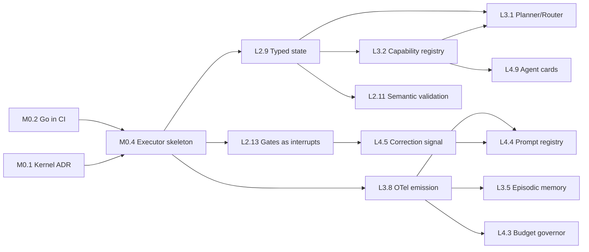

# `loom` Build Roadmap — L2 → L4

**Status**: active build plan · **Framework version**: v3.3.14 @ `59efe14` · **Compiled**: 2026-08-29
· **Status markers last reconciled**: 2026-08-31

> **Reading the Problem statements.** Each item's "Problem" paragraph describes the state of the
> repository *when this roadmap was compiled*, in present tense. Items that have since shipped carry
> a **SHIPPED** line under their workstream header — read that first, because the Problem paragraph
> below it is deliberately preserved as the historical motivation, not as a current claim.
>
> Absence of a SHIPPED line means only that no one has reconciled it, not that the work is unbuilt.

> **First real end-to-end run: 2026-09-06.** Every item above M0.4 had been verified against
> `--provider mock` until then. One run with `--provider claude` — five stages, seven minutes,
> $3.57, 3.8M tokens — produced two new items (**L2.21**, **L3.16**), confirmed that L2.9's typed
> invariants stop a bad run on real data, and showed that the router takes a materially different
> path on a real analysis (10 of 12 stages, against the mock's 7). Mock-driven tests systematically
> under-exercise this pipeline; that is worth remembering when an item claims to be verified.
> Markers below were verified against the code on the date above; older milestones (M0.1–M0.3, L2.4,
> D.1–D.5) shipped earlier and are tracked in `docs/prompts/README.md`'s Completed Prompts table.

This is the single authoritative roadmap. It merges and supersedes:

| Source | Items | Disposition |
|---|---|---|
| [`agy.md`](agy.md) | 9 | Fully absorbed. Two items contributed material this plan did not have (host-IDE execution dependency; context-isolated reflexion). Two path citations corrected — see Appendix B. |
| [`maturity-todo-2026-08-29.md`](maturity-todo-2026-08-29.md) | 41 | Fully absorbed, re-sequenced into milestones with dependencies and acceptance criteria. |
| [`architectural-audit-2026-08-29.md`](architectural-audit-2026-08-29.md) | H1–H11 | Retained as the evidence document. Not superseded — read it for the *why*; read this for the *what next*. |

**45 items across 5 milestones**, plus the appended **PLATFORM — Distribution & Adoption**
workstream (D.1–D.5, appended 2026-08-29 from the distribution-strategy discussion — see
`docs/prompts/epic-75-distribution-adoption.md` for the executable handoff prompts). Every path
cited was verified to resolve on 2026-08-29.

---

## How to use this document

Each item carries six fields:

| Field | Meaning |
|---|---|
| **ID** | Stable reference (`M0.1`, `L2.4`, …). Never renumber — append instead. |
| **Workstream** | Which parallel track this belongs to. Items in different workstreams can proceed concurrently. |
| **Effort** | S = under a day · M = a few days · L = a week or two · XL = a month+ |
| **Blocked by / Blocks** | Hard dependency edges. Respect these; the sequencing is not advisory. |
| **Problem / Fix / Target Files** | As in the source documents. |
| **Done when** | A falsifiable acceptance criterion. If you cannot demonstrate it, the item is not done. |

Workstreams:

- **KERNEL** — the executor process: state, checkpoints, gates, retries, budget
- **TOOLS** — the MCP tool runtime: registry, validation, resilience, transport
- **MEMORY** — retrieval, episodic store, KI lifecycle
- **OBSERVE** — telemetry, evaluation, CI
- **PLATFORM** — provider abstraction, interop, distribution

---

## Critical path



**If only three things get built**: `L2.9` (typed state), `M0.4`+`L2.13` (executor owning gates and
retries), and `L3.8` (OTel emission). Those unblock roughly two-thirds of everything else.

---

# MILESTONE 0 — Foundations

Nothing else is safely buildable until these land. M0.2 in particular is one day of work and is the
highest-leverage item in the entire document.

### M0.1 — Decide and record what `loom` is
**Workstream**: KERNEL · **Effort**: S · **Blocked by**: none · **Blocks**: M0.4

1. **Problem**: The repository is 52k lines of markdown specification and 8.9k lines of Go that only
   installs files. `README.md` and `docs/ARCHITECTURE.md` describe orchestration, telemetry, policy
   evaluation, and retrieval tiers as though implemented; all are prose with no executor. The
   ambiguity is load-bearing — it is why 20 items below target an `internal/orchestrator/` that does
   not exist, and why `agy.md` and `maturity-todo` both independently proposed "build a kernel"
   without either committing to it.
2. **Architectural Fix**: Write ADR-00N answering one question: does `loom` **execute** pipelines, or
   does it **validate and distribute** content a host runtime executes? Both are defensible products.
   Every item in M0.4 onward assumes the first. If the answer is the second, delete Milestones 1–4
   and reduce this to a content-quality roadmap — that is a legitimate outcome, but it must be chosen
   rather than drifted into.
3. **Target Files**: new `docs/adrs/`, `README.md`, `docs/ARCHITECTURE.md`
4. **Done when**: an accepted ADR exists and `README.md` no longer describes unimplemented subsystems
   in the present tense.

### M0.2 — Put the Go in CI and turn the framework's rules on itself
**Workstream**: OBSERVE · **Effort**: S · **Blocked by**: none · **Blocks**: M0.4 · *(audit H9)*

1. **Problem**: `.github/workflows/framework-ci.yml` runs five bash/python scripts and **zero Go
   steps** — no `go build`, `go test`, `go vet`, `golangci-lint`. There is no `.golangci.yml`.
   `shared/mcp/` has **0.0% coverage in every package** against the non-negotiable 85% rule. The
   workflow has **no `permissions:` block** and pins `actions/checkout@v4` (mutable tag) across all
   six jobs — both violations of `iac-conventions.md`, which `loom-release.yml` gets right. And
   `scripts/test-agents.sh` reports "20 passed, 0 failed, 32 skipped" from **one** `actual-output.md`
   across 33 fixture dirs, because SKIP exits 0 by design.
2. **Architectural Fix**: Add build/test/vet/lint jobs for both modules. Write the `.golangci.yml`
   the framework mandates elsewhere, with `gocyclo` capped at 6. Add a coverage ratchet starting at
   today's real number. Add `permissions:` and SHA-pin every action. Make the agent suite fail on
   missing fixtures rather than passing. Then run the framework's own `verify_dependencies` and
   `analyze_complexity` against this repo — the first *will* fail on M0.3's finding, which is the
   point.
3. **Target Files**: `.github/workflows/framework-ci.yml`, new `.golangci.yml`,
   `scripts/test-agents.sh`, `scripts/ci-check.sh`, `Makefile`
4. **Done when**: CI fails on a deliberately introduced compile error, a deliberately introduced
   complexity-9 function, and a deliberately deleted test fixture.

### M0.3 — Fix the domain-layer dependency violation
**Workstream**: TOOLS · **Effort**: S · **Blocked by**: M0.2 · **Blocks**: L2.1 · *(audit H4)*

1. **Problem**: `shared/mcp/internal/domain/tool.go` — commented as "the framework's first-class
   abstraction for every capability" — imports `github.com/mark3labs/mcp-go/mcp` and
   `invopop/jsonschema`, and types its own signatures in them (`mcp.ToolInputSchema`,
   `mcp.CallToolRequest`, `*mcp.CallToolResult`). That is `architecture-guardrails.md` #1 violated in
   the one file defining the tool abstraction, in the framework that sells verifiable architecture.
2. **Architectural Fix**: Hexagonal port/adapter. Define transport-free
   `ToolRequest{Name string; Args map[string]any}` and
   `ToolResult{Content []ContentBlock; IsError bool; Err error}` in `domain`; move all `mcp.*`
   marshalling into a new `server/mcp_adapter.go`. `domain` imports zero third-party packages.
3. **Target Files**: `shared/mcp/internal/domain/tool.go`,
   `shared/mcp/internal/server/registration.go`, all 6 `shared/mcp/internal/tools/*_tool.go`
4. **Done when**: `go list -deps ./internal/domain` shows only stdlib, and the CI fitness function
   from M0.2 enforces it.

### M0.4 — Stand up the executor skeleton
**Workstream**: KERNEL · **Effort**: L · **Blocked by**: M0.1, M0.2 · **Blocks**: L2.9, L2.12, L2.13, L2.14, L3.1, L3.3, L3.8, L4.1

**SHIPPED** 2026-08-29 (epic 76, `ba78f21` + `cab0156`) — `internal/orchestrator/` owns the run
loop and durable `run-state.json`; `loom run` executes the built-in plan via a claude subprocess
provider, with a mock provider for tests.

1. **Problem**: Both source roadmaps assume a kernel and neither builds one. `agy.md` item 1 names it
   ("a native tool orchestration kernel"); the maturity TODO targets `internal/orchestrator/*` in
   nine separate items. It does not exist. Today `loom` has **no execution engine at all** — it
   generates prompt configurations and relies entirely on host platforms (Claude Code, Cursor,
   Windsurf) to run agents, which ties framework resilience, retry semantics, and gate enforcement to
   proprietary IDE behavior the framework cannot observe or control.
2. **Architectural Fix**: A minimal Go executor that owns the run loop: load a plan, execute stages
   in order, persist state, invoke an agent via a provider adapter, and stop. No routing, no
   parallelism, no policy — those are later items that plug into it. Ship it running the existing
   linear `deliver-feature` sequence as a hardcoded default plan, so behavior is preserved while the
   substrate changes underneath.
3. **Target Files**: new `internal/orchestrator/` (executor, stage, plan), new `internal/provider/`,
   `cmd/loom/cmd/` (new `run` subcommand)
4. **Done when**: `loom run --spec features/<x>.md` executes at least three real stages end-to-end,
   writes state, and resumes correctly after `SIGINT`.

### M0.5 — Delete or compile `shared/mcp-patterns/go/`
**Workstream**: TOOLS · **Effort**: S · **Blocked by**: none · **Blocks**: none · *(audit H10)*

**SHIPPED** 2026-09-02 (epic 89) — deleted. Twenty `//go:build ignore` files in no module,
compiled by nothing, presented as templates to copy. No Go file in the repository carries that tag
any more.

Deleting it left three porting guides pointing at nothing, and they now read
`shared/mcp/internal/` instead — the implementation that is actually compiled and tested on every
CI run, which is precisely the property the templates lacked. `shared/mcp-patterns/README.md`
documents `register.Frameworks` as the supported Go path, with `examples/embedding/` as a working
server that CI builds, so the embedding path breaking is a build failure rather than a copy
silently rotting.

1. **Problem**: ~1,200 lines of `//go:build ignore` copies of `shared/mcp/internal/`, in no Go
   module, referenced by no build, presented as the reference implementation teams should copy. All
   11 shared files have diverged from their originals (`retriever.go` by 186 diff lines,
   `bm25_retriever.go` by 106). It ships bugs downstream — including the concurrency defect its own
   comment documents at line 40 — and can never be compiled, tested, or kept honest.
2. **Architectural Fix**: Delete it. If a reference implementation is genuinely wanted, make it a
   compiled example module in the workspace with its own tests, so drift becomes a build failure.
   Copy-paste distribution of a Go library is the wrong mechanism when `register.FrameworkTools`
   already exists as a supported embedding path.
3. **Target Files**: `shared/mcp-patterns/go/**` (delete), `shared/mcp-patterns/README.md`,
   `shared/mcp/register/register.go`
4. **Done when**: no `//go:build ignore` file remains in the repo and `README.md` documents
   `register.FrameworkTools` as the supported integration path.

---

# MILESTONE 1 — Level 2: Coordinated Multi-Agent Systems

*Agents are task-specific, use tools reliably, and coordinate in deterministic workflows with
human-in-the-loop control.*

## Workstream: TOOLS — Tool Execution & Validation

### L2.1 — Enforce input schemas server-side instead of trusting the model
**Workstream**: TOOLS · **Effort**: M · **Blocked by**: M0.3 · **Blocks**: L2.5

1. **Problem**: `InputSchema()` exists only to describe arguments *to the LLM*. Enforcement is
   unchecked type assertion — `parseComplexityArgs` does `args["projectPath"].(string)` and silently
   yields `""` on any non-string, then returns a generic error. A hallucinated argument shape
   produces a soft failure the model re-attempts blindly. No required-field check, no enum check, no
   bounds.
2. **Architectural Fix**: Validate every `Args` map against the tool's declared JSON Schema at the
   handler boundary *before* dispatch, returning a structured `ValidationError` naming the offending
   field and expected type — a machine-actionable repair signal, not prose.
   `github.com/santhosh-tekuri/jsonschema/v6` is **already in the dependency graph** as an indirect
   dep of `mcp-go`; promote it to direct.
3. **Target Files**: `shared/mcp/internal/server/registration.go`,
   `shared/mcp/internal/tools/schemas.go`, `shared/mcp/go.mod`
4. **Done when**: a malformed-argument call returns a field-level validation error, and a test
   asserts it for all six tools.

### L2.2 — Propagate `context.Context` and set per-tool deadlines
**Workstream**: TOOLS · **Effort**: M · **Blocked by**: M0.3 · **Blocks**: L2.5

1. **Problem**: All six tools sign `Execute(_ context.Context, ...)` —
   `analyze_complexity_tool.go:54`, `check_accessibility_tool.go:52`,
   `check_ubiquitous_language_tool.go:50`, `search_docs_tool.go:64`, `search_ki_tool.go:56`,
   `verify_dependencies_tool.go:40`. Cancellation is discarded 100% of the time. A client
   disconnect, timeout, or user abort cannot stop an in-flight `filepath.Walk`.
   `go-conventions.md` mandates explicit timeouts; the tool layer has none.
2. **Architectural Fix**: Thread `ctx` through `Execute` → analyzer → walk, checking `ctx.Err()`
   inside every `filepath.WalkDir` callback. Add registration middleware applying
   `context.WithTimeout` from a per-tool budget in the registry entry.
3. **Target Files**: all 6 `shared/mcp/internal/tools/*_tool.go`,
   `shared/mcp/internal/analyzers/*.go`, `shared/mcp/internal/server/registration.go`
4. **Done when**: a cancelled context aborts an in-progress walk within 100ms, proven by test.

### L2.3 — Confine filesystem access to an explicit root
**Workstream**: TOOLS · **Effort**: M · **Blocked by**: M0.3 · **Blocks**: none

1. **Problem**: `analyze_complexity` accepts an arbitrary `projectPath` from model-controlled
   arguments with no validation, no root confinement, and no symlink handling, then walks it
   unbounded and uncancellably. `projectPath: "/"` walks the disk. Same pattern in
   `check_accessibility`, `check_ubiquitous_language`, `verify_dependencies`, and `search_docs`
   (`docsPath`).
2. **Architectural Fix**: Adopt `os.Root` (available on `go 1.26.5`) for traversal-safe rooted FS
   access, with the root supplied by server config rather than tool arguments. Reject paths that
   escape it. Add a file-count and byte ceiling to abort runaway walks.
3. **Target Files**: `shared/mcp/internal/analyzers/walkutil.go`,
   `shared/mcp/internal/analyzers/*_analyzer.go`, `shared/mcp/internal/server/tool_provider.go`
4. **Done when**: `projectPath: "/"` and `projectPath: "../../etc"` are both rejected, with tests.

### L2.4 — Replace the hardcoded tool slice with a registry
**Workstream**: TOOLS · **Effort**: M · **Blocked by**: M0.3 · **Blocks**: L2.2, L2.5, L3.2, L4.7

1. **Problem**: `buildFrameworkTools()` is a slice literal returning six constructor calls. Adding a
   tool means editing and recompiling the handler. No discovery, no per-tool metadata (timeout,
   retry policy, permission scope, version), no enable/disable, and no way for a downstream project
   to contribute a tool without forking.
2. **Architectural Fix**: `map[string]ToolRegistration` where the registration carries the `Tool`,
   its timeout, retry class, and required permission scope. Populate via per-file `Register(name,
   reg)` or an explicit registry-builder consuming config. `register.FrameworkTools` becomes a
   registry merge rather than wholesale re-registration.
3. **Target Files**: `shared/mcp/internal/server/tool_provider.go`,
   `shared/mcp/internal/server/handler.go`, `shared/mcp/register/register.go`
4. **Done when**: a new tool is added by one `Register` call with no edit to `handler.go`.

### L2.5 — Introduce a typed failure taxonomy
**Workstream**: TOOLS · **Effort**: M · **Blocked by**: L2.1, L2.2, L2.4 · **Blocks**: L2.6, L4.2

1. **Problem**: Every failure path collapses to `mcp.NewToolResultError(fmt.Sprintf(...))` with
   `err == nil` — a *successful* tool call carrying a prose error string. The caller cannot
   distinguish "bad argument, fix and retry" from "corpus missing, stop" from "transient I/O, back
   off." `search_docs` goes further, returning `Success: true, TotalHits: 0` with the failure reason
   smuggled into the `Query` field (`emptyResult`, line 101) — indistinguishable from a genuine
   zero-result search.
2. **Architectural Fix**:
   `ToolError{Kind: Validation|NotFound|Transient|Internal|Permission, Field, Message, Retryable bool}`
   serialized into a stable `error` envelope. Never encode failure state into a success payload.
   Orchestrator retry policy keys off `Kind`.
3. **Target Files**: `shared/mcp/internal/tools/responses.go`,
   `shared/mcp/internal/tools/search_docs_tool.go:101`, all `*_tool.go` error branches
4. **Done when**: no tool returns `Success: true` on a failure path, enforced by test.

### L2.6 — Add the resilience primitives the guardrails already mandate
**Workstream**: TOOLS · **Effort**: M · **Blocked by**: L2.5 · **Blocks**: L4.7

1. **Problem**: `architecture-guardrails.md` #5 forbids hand-rolled retry loops and requires
   `CircuitBreaker` or `ExponentialBackoffStrategy`. Neither exists anywhere in the Go tree. The only
   retry logic in the framework is prose in `deliver-feature/SKILL.md` telling an LLM to count to
   three.
2. **Architectural Fix**: `sony/gobreaker` per tool and per downstream dependency, plus
   `cenkalti/backoff/v4` for `Transient`-classed failures, wired as registry middleware so no tool
   implements its own retry. Emit breaker state transitions as telemetry.
3. **Target Files**: new `shared/mcp/internal/server/middleware.go`,
   `shared/mcp/internal/server/registration.go`, `shared/mcp/go.mod`
4. **Done when**: a tool failing 5× consecutively opens its breaker and returns immediately, proven
   by test.

### L2.7 — Fix the per-query full-corpus re-index
**Workstream**: TOOLS · **Effort**: M · **Blocked by**: L2.2 · **Blocks**: L3.7 · *(audit H2)*

1. **Problem**: `search_docs_tool.go:82` calls `EnsureIndex` inside `Execute`.
   `bm25_retriever.go:70` then walks the whole docs tree, `os.ReadFile`s every `.md`, and runs **one
   sqlite transaction per file** — no mtime check, no content hash, no dirty tracking. Every search
   is O(corpus) disk I/O plus O(n) transactions. `shared/mcp-patterns/go/tools/bm25_retriever.go:40`
   documents the rest: "EnsureIndex is not safe to call concurrently with itself" — and MCP servers
   field concurrent calls. Deleted docs are never evicted; `DELETE` only fires for re-inserted paths.
2. **Architectural Fix**: Move indexing out of the query path. Incremental index keyed on
   `(path, mtime, size)` or content hash in one batched transaction; a separate explicit
   `reindex_docs` tool plus optional `fsnotify` watcher; `sync.RWMutex` around writer access; a
   reconciliation sweep deleting rows whose paths no longer exist.
3. **Target Files**: `shared/mcp/internal/tools/bm25_retriever.go`,
   `shared/mcp/internal/tools/search_docs_tool.go`
4. **Done when**: a second identical query performs zero file reads, and a deleted doc disappears
   from results.

### L2.8 — Ship MCP over an authenticated network transport
**Workstream**: TOOLS · **Effort**: L · **Blocked by**: L2.4 · **Blocks**: L4.8

1. **Problem**: `cmd/mcp-server/main.go` calls `server.ServeStdio(s)` — stdio only. No streamable
   HTTP, no SSE, no authentication, no authorization, no tenancy, no per-caller rate limiting. The
   server is single-user, local-only, and has no notion of *who* is calling.
2. **Architectural Fix**: Streamable HTTP transport alongside stdio, with OAuth2/OIDC bearer
   validation, per-principal tool scoping enforced against the registry's permission field, and
   per-principal rate limits. Keep stdio for local dev.
3. **Target Files**: `shared/mcp/cmd/mcp-server/main.go`, `shared/mcp/internal/server/handler.go`,
   new `shared/mcp/internal/server/auth.go`
4. **Done when**: an unauthenticated HTTP call is rejected and a scoped token can reach only its
   permitted tools.

## Workstream: KERNEL — State Management

### L2.9 — Replace markdown-file state passing with a typed graph state
**Workstream**: KERNEL · **Effort**: XL · **Blocked by**: M0.4 · **Blocks**: L2.10, L2.11, L3.1, L3.2, L4.4

**SHIPPED (first cut)** 2026-08-31 (epic 79, `74155f1`…`3430594`) — `internal/state/` types the
analyst → architect hop: Go structs, JSON Schema generated into `shared/schemas/pipeline/`,
field-level projections, and markdown rendered as a view.

**SHIPPED (second cut)** 2026-09-01 (epic 83, `0b2d6c4`…) — the implementation chain:
`implementation-notes`, `security-report`, and `qa-report` are typed, joining `analysis`,
`architecture`, `route` (L3.0) and `review` (L2.17) for **seven typed artifacts**. Two contract
content rules became load-time invariants rather than greps — a non-zero `failed` test count and a
CRITICAL/HIGH security finding with no fix applied are now validation errors. `Stage.Consumes` became
plural and projections are keyed by `(consumer stage, upstream kind)`, since what a stage reads and
what it writes vary independently. **Eight of the fifteen artifacts still pass markdown** — the
end-of-pipeline reports (docs, devops, observability, accessibility, visual QA) and
`context-manifest`. Nothing evaluates a condition over those yet, which is why they were left.

1. **Problem**: There is no state object. Agents hand each other whole markdown documents on disk
   (`analysis.md`, `architecture-notes.md`, `implementation-notes.md`, … 15 artifacts). The only real
   delivery in the repo has a 15 KB `analysis.md`. Every downstream agent re-parses the full text;
   there is no field-level access, no size ceiling, no provenance, and no way to pass a value without
   passing a document.
2. **Architectural Fix**: A versioned `PipelineState` struct with per-stage typed sub-schemas (Go
   structs plus generated JSON Schema, or CUE as single source of truth). Markdown becomes a
   *rendered view* of state, not the transport. Agents receive a narrowly-scoped projection of the
   fields their contract declares, never the whole graph. `agy.md` proposed LangGraph or a custom
   FSM; a custom FSM is the right call here since the executor is Go and LangGraph would reintroduce
   a Python runtime dependency.
3. **Target Files**: `shared/orchestration/pipeline-schema.md` → generated; all 18
   `shared/contracts/*.md` → schemas; `shared/skills/deliver-feature/SKILL.md`; new `internal/state/`
4. **Done when**: two consecutive stages exchange data with no markdown file on the path, and a
   schema violation is a load-time error.

### L2.10 — Stop using an LLM as the context-compaction mechanism
**Workstream**: KERNEL · **Effort**: S (was M) · **Blocked by**: L2.9 · **Blocks**: none

**PARTLY ABSORBED** by epic 83 (2026-09-01). The two inter-stage call sites that existed were
replaced with deterministic projections of `AnalysisState`: `qa-engineer` (step 2) now receives
acceptance criteria, edge cases, QA tasks and the definition of done; `tech-writer` (step 1) receives
the summary, out-of-scope list and its own task list. Both agent files were edited and versioned.
Under `loom run` **no LLM call sits between the analysis and either agent**.

**What remains**:
1. The step 37a `--persist` retrieval surrogate in `deliver-feature/SKILL.md`, which is a *different*
   problem — the surrogate feeds `memory-registry`'s retrieval tier and has consumers of its own, so
   "replace it with field selection" is not the right fix and this item's done-when does not cover it.
   Deciding what the surrogate becomes is the open question here.
2. The markdown pipeline's fallback paths. Each edited agent keeps a no-executor path that reads the
   two relevant sections rather than the whole file — smaller context, but still a read the executor
   does by field selection. This closes only when those agents run under the executor.
3. Any call site introduced by typing the remaining eight artifacts.

1. **Problem**: Context decay is handled by `summarize-artifact --persist`, invoked at
   `deliver-feature/SKILL.md` step 37a — another LLM call producing a lossy ~200-word surrogate then
   indexed as a retrieval target. Compaction is nondeterministic, unverifiable, costs a model call,
   and silently drops whatever the summarizer deemed unimportant.
2. **Architectural Fix**: Deterministic projections. Each contract declares which fields downstream
   stages may read; the executor computes the projection by field selection, not summarization.
   Reserve LLM summarization for human-facing prose only, never machine handoff.
3. **Target Files**: `shared/skills/summarize-artifact/SKILL.md`,
   `shared/skills/deliver-feature/SKILL.md:139`, `shared/contracts/*.md`
4. **Done when**: no LLM call sits on the inter-stage data path.

### L2.11 — Make `validate-artifact` verify semantics, not heading presence
**Workstream**: KERNEL · **Effort**: M · **Blocked by**: L2.9 · **Blocks**: none

1. **Problem**: Contract validation checks that required `##` sections exist.
   `agent-scorecard/SKILL.md:29` confirms the depth: the analyst's "completeness score" is "fraction
   of required sections present **and** containing real content (not leftover `[...]` template
   placeholders)." That is a template-placeholder grep. A structurally perfect, semantically empty
   artifact passes every gate in the pipeline.
2. **Architectural Fix**: With typed state, validation becomes JSON Schema conformance plus
   declarative business rules — required cardinality, cross-field consistency, referential integrity
   against prior stages. Keep an LLM critic as an *additional* qualitative gate, never the structural
   one.
3. **Target Files**: `shared/skills/validate-artifact/SKILL.md`, `shared/contracts/*.md`,
   `shared/schemas/`
4. **Done when**: an artifact with all headings present but contradictory field values fails
   validation.

### L2.12 — Move `pipeline-state.json` ownership into the executor
**Workstream**: KERNEL · **Effort**: M · **Blocked by**: M0.4 · **Blocks**: L2.14

**SHIPPED** 2026-08-31 (epic 78, `8441ffc`…`7e574c9`) — digests are computed and re-verified in
Go, an edited artifact demotes its stage and cascades, and `loom state record/verify/approve/show/
timeline` gives the markdown pipeline a way to record checkpoints without hashing its own work.
`run-events.jsonl` gives events and timing an owner.

1. **Problem**: The state file — including SHA-256 checksums used for tamper detection and gate-edit
   detection — is written *by the LLM following prose instructions* (`deliver-feature/SKILL.md`,
   "Checkpointing & Pipeline State"). A model computing and recording its own integrity hashes is not
   integrity. No `pipeline-state.json` exists anywhere in the repo, so this has never executed.
2. **Architectural Fix**: The executor owns the file: atomic write (temp + `os.Rename`), a schema
   version field, real `sha256` computed in Go, verification on resume in code rather than by
   instruction. Agents never write it.
3. **Target Files**: `shared/skills/deliver-feature/SKILL.md`,
   `shared/skills/resume-pipeline/SKILL.md`, new `internal/orchestrator/checkpoint.go`
4. **Done when**: hand-editing an artifact causes the executor to detect the mismatch and refuse to
   treat that stage as complete.

## Workstream: KERNEL — Human-in-the-Loop

### L2.13 — Implement gates as process interrupts, not prose
**Workstream**: KERNEL · **Effort**: L · **Blocked by**: M0.4 · **Blocks**: L2.14, L4.5

**SHIPPED** 2026-08-30 (epic 77, `868c281`…`a971b2f`) — the executor refuses to start a gated
stage without a recorded human approval; approval arrives only via a TTY prompt or
`loom run --resume --approve <gate>`, and a halted run exits 3. Provider output cannot self-approve.
**Scope**: `loom run` only — the markdown pipeline and the other prose gates remain
prompt-discipline.

1. **Problem**: All eight gates in `approval-gates.md` are natural-language instructions ("user must
   say 'ship'"). The enforcement mechanism for an irreversible action — DB contract-phase `DROP`,
   deploy, external API mutation — is the model's willingness to comply with a paragraph. There is no
   code path that can physically prevent the action, and an LLM can hallucinate straight past a
   prompt-level guard.
2. **Architectural Fix**: The executor halts the process at gate boundaries, persists state, and
   yields to a real approval channel (CLI prompt, webhook, or queue). High-risk tool classes are
   declared in the tool registry and are *unreachable* without a signed approval token in the
   request. Enforcement lives below the model, not in it.
3. **Target Files**: `shared/rules/approval-gates.md`,
   `shared/skills/deliver-feature/SKILL.md:130-133`, new `internal/orchestrator/gate.go`, registry
   entries
4. **Done when**: an agent instructed to "skip the gate and deploy" cannot reach the deploy tool.

### L2.14 — Enforce "any edit resets the gate" in code
**Workstream**: KERNEL · **Effort**: M · **Blocked by**: L2.12, L2.13 · **Blocks**: L4.5

**SHIPPED** 2026-08-31 (epic 80, `27ac1f0`…`9db60ee`) — an approval binds to the digests of every
stage completed when it was given; an edit invalidates it, the run halts at that gate again, and the
invalidated record is kept for audit. Detection at verification rather than at the barrier, since a
re-run would otherwise overwrite the edit that caused it. `loom state verify` reports the same for
markdown-pipeline runs — detection, not enforcement.

1. **Problem**: Every gate in `approval-gates.md` declares "Reset condition: any edit to the pending
   artifact resets the gate." Nothing enforces it. The `gate_decision` telemetry spec describes
   checksum-diffing to detect `edited_then_approved` — but the checksum is computed by the model, the
   event is emitted by nobody, and no `events.jsonl` exists in the repository.
2. **Architectural Fix**: Approval binds to an artifact digest. The executor computes the digest at
   halt, issues a scoped approval token over it, and re-verifies at execution. Digest mismatch
   invalidates the token — a code-level check, not a remembered rule.
3. **Target Files**: `shared/rules/approval-gates.md`, `shared/telemetry/event-schema.md:112`,
   `internal/orchestrator/gate.go`
4. **Done when**: editing an artifact between approval and execution causes the execution to be
   refused.

### L2.15 — Make resume a real capability
**Workstream**: KERNEL · **Effort**: M · **Blocked by**: L2.12 · **Blocks**: none

1. **Problem**: `resume-pipeline/SKILL.md` implements three modes (resume, `--from-phase N`, per-agent
   rollback) entirely as instructions to an LLM to read state, recompute checksums, mark entries
   `"stale": true`, and jump to a numbered step in *another skill's* prose. There is no process to
   resume — the "pause" was only ever the model stopping. Steps are addressed by position in a
   hand-numbered 43-step list, so renumbering silently breaks every resume path.
2. **Architectural Fix**: Durable executor with content-addressed stage IDs (never ordinals), a real
   checkpoint store, and resume as a first-class operation replaying from persisted state. Rollback
   becomes state-graph surgery in code, not markdown restoration by instruction.
3. **Target Files**: `shared/skills/resume-pipeline/SKILL.md`,
   `shared/skills/deliver-feature/SKILL.md`, `shared/orchestration/interface.md`
4. **Done when**: `kill -9` mid-stage followed by `loom run --resume` continues from the last
   checkpoint with no duplicated work.

### L2.16 — Replace the LLM policy evaluator with a real one
**Workstream**: KERNEL · **Effort**: M · **Blocked by**: L2.13 (shipped) · **Blocks**: L4.3 · *(audit H7)*

**SHIPPED** 2026-09-02 (epic 87, `da5d829`…) — `internal/policy` loads, validates and evaluates
policies in typed Go. Every decision is recorded as `policy.evaluated` on the run event timeline and
in `run-state.json`; `loom run --dry-run-policies` replays them against a finished run.

**No expression language, against this item's own suggestion of CEL or Rego.** The condition
vocabulary is closed and small — nine fields over facts the executor already holds. CEL would buy
arbitrary boolean logic at the cost of a dependency, a cost-limiting surface, and a gate decision
written in a language most readers of a `.policy.yaml` will not know. Epic 82 reached the same
conclusion for loop conditions. Adding a check is now a code change with a test, which is the right
direction for a mechanism whose purpose is skipping human review.

**Nothing is auto-approved, deliberately.** A matching `auto-approve` policy is recorded as what
*would* have happened and the executor halts for a human anyway; every record carries
`honoured: false`. The first run that skips a barrier should not also be the first evidence the
evaluator decides what a human would. Honouring a decision is **L2.19**.

**Three prose controls became code.** The always-human list is a compiled constant and a policy
targeting one of those five gates fails at load, naming the gate — it used to be "silently
ignored", so someone writing a policy to auto-approve a deployment saw no error. `policiesEnabled:
false` now actually disables evaluation; it had been documented in three files and read by nothing.
And an unanswerable condition resolves to **unknown**, never true.

**What building it found.**

1. **The two gate vocabularies did not overlap.** Policy gate IDs named actions (`git-commit`,
   `deploy`); the executor's named stage progressions (`confirm-design`, `confirm-ship`). No valid
   policy could name a barrier `loom run` has, so evaluation would have run zero times forever. The
   executor's four gates are now policy-eligible. `confirm-ship` needs care in prose: it *precedes*
   the ship, commit and deploy gates rather than being one.
2. **The done-when's invalid YAML is worse than reported.** It names `policy-schema.md`'s example;
   `auto-approve-refactor.policy.yaml` — the example *this file* cites as its reference policy for
   `git-commit` — also had a duplicate `filePaths` key and had never been parsed. A lenient reader
   takes the second and discards the first, so its `**/security/**` exclusion would never have run.
3. **Five of nine condition fields have no source.** `diffLines`, `diffType`, `dryRunPass`,
   `fitnessFunction.allPass`, `codeReviewer.behaviorChange` are measured by nothing. Sourcing them
   is **L2.20**.

1. **Problem**: `policy-evaluator.md` specifies a condition language
   (`filePaths.noneMatch: "**/security/**"`, `diffLines.lessThan`, `not:`, `any:`) whose evaluator is
   a prompt. An authorization decision — *may this pipeline commit without a human* — is resolved by
   natural-language reasoning over YAML, with the kill-switch, the always-human list, and the
   conflict-resolution table all in the same prose the model may misread. `policy-schema.md`'s own
   worked example has a duplicate `diffType:` key in one map, which is invalid YAML — no parser has
   ever seen it.
2. **Architectural Fix**: `google/cel-go` or OPA/Rego. The condition schema maps near-directly onto
   CEL. The always-human gate list becomes a compiled constant. Add a policy unit-test harness and
   make `--dry-run-policies` actually execute.
3. **Target Files**: `shared/orchestration/policy-evaluator.md`, `shared/policies/policy-schema.md`,
   `shared/policies/examples/*.policy.yaml`, new `internal/policy/`
4. **Done when**: a policy targeting an always-human gate is rejected at load time, and the invalid
   YAML example above fails to parse.

### L2.19 — Honour a policy decision at a gate
**Workstream**: KERNEL · **Effort**: S · **Blocked by**: L2.16 (shipped) · **Blocks**: none · *(raised 2026-09-02)*

1. **Problem**: L2.16 evaluates policies and records what they decided, then halts for a human
   anyway. The feature people actually want from policies — a gate that proceeds without a
   prompt — does not exist. That was deliberate: the first run to skip a barrier should not also be
   the first evidence the evaluator is correct.
2. **Architectural Fix**: `checkGate` honours a decision whose effect is `auto-approve`, recording
   `honoured: true` and an approval attributed to the policy rather than to a person. Gated behind
   the existing `policiesEnabled` switch, and never for an always-human gate, which cannot be
   targeted at all. The change is small; the evidence it needs is not.
3. **Target Files**: `internal/orchestrator/gate.go`, `policy_gate.go`, `shared/rules/approval-gates.md`
4. **Done when**: a run with a matching auto-approve policy proceeds without a prompt, the approval
   names the policy, and recorded history shows the same decisions before and after the change.

**Do not build this until real runs show the evaluator deciding what a human would.** That is the
entire reason L2.16 stopped short, and the records it writes are how the question gets answered.

### L2.20 — Source the condition facts nothing measures
**Workstream**: KERNEL · **Effort**: M · **Blocked by**: L2.16 (shipped) · **Blocks**: none · *(raised 2026-09-02)*

1. **Problem**: `policy-schema.md` declares nine condition fields; four have a source in run state.
   `diffLines`, `diffType`, `dryRunPass`, `fitnessFunction.allPass` and
   `codeReviewer.behaviorChange` are measured by nothing, so three of the five shipped example
   policies can never evaluate — they report **unknown**, correctly and uselessly.
2. **Architectural Fix**: Each fact needs a real source, and they are not the same kind of work.
   Diff size and type mean the executor learning to run `git diff`, which it does not do today and
   which raises its own question (diff against what — the run's start, the branch point, HEAD?).
   `fitnessFunction.allPass` and `dryRunPass` mean capturing CI results the executor never sees.
   `codeReviewer.behaviorChange` is a field the review contract could simply declare, and is the
   cheap one.
3. **Target Files**: `internal/orchestrator/policy_gate.go`, `internal/state/review_state.go`,
   new diff source, `shared/policies/README.md`
4. **Done when**: every field `policy-schema.md` declares either resolves from run state or is
   removed from the schema — a vocabulary should not describe questions nothing can answer.

---

## Workstream: PLATFORM — Distribution & Adoption

*Appended 2026-08-29. Strategy: MCP becomes the portable capability surface (executable behavior on
every MCP-speaking host); the dotfile/markdown export becomes the Level 1 convenience layer. loom
ships both a standalone server (`loom mcp serve`) and a semver'd embedding package, from one module.
The maturity ladder (L1→L4) becomes a first-class install concept rather than a roadmap-only idea.
These items constitute loom's **public API** — several are adoptable by external teams before the
orchestration kernel exists, which is why they sit in Milestone 1 despite spanning levels.*

### D.1 — Fold the MCP server into the `loom` binary as `loom mcp serve`
**Workstream**: PLATFORM · **Effort**: M · **Blocked by**: none · **Blocks**: D.3, D.5

1. **Problem**: The MCP server is a separate module with its own entrypoint
   (`shared/mcp/cmd/mcp-server/main.go`, own `go.mod`), while the distributed binary is `cmd/loom/`.
   Teams adopting via `brew install orieken/tap/loom` get the installer but not the server — the
   framework's only *executable* capabilities require a second, unpublished build. Two artifacts,
   one tap entry.
2. **Architectural Fix**: Add a `loom mcp serve` Cobra subcommand that starts the server over stdio
   (network transport arrives with L2.8). Either merge the `shared/mcp` module into the root module
   or add a `go.work`/`replace` so one `goreleaser` build embeds both. The standalone
   `mcp-server` binary is kept building through one release cycle, then removed.
3. **Target Files**: `cmd/loom/cmd/` (new `mcp.go`, `mcp_serve.go`), `go.mod`,
   `shared/mcp/cmd/mcp-server/main.go`, `shared/mcp/register/register.go`, `.goreleaser` config
4. **Done when**: `brew install`ed `loom mcp serve` responds to an MCP `tools/list` over stdio with
   all six framework tools, and the release pipeline ships exactly one binary per platform.

### D.2 — Publish the embedding API as a semver'd public package
**Workstream**: PLATFORM · **Effort**: M · **Blocked by**: M0.3, L2.4 · **Blocks**: D.5

1. **Problem**: `register.FrameworkTools` is the right seam for "use loom's tools in your own MCP
   server," but it takes `*server.MCPServer` from `mark3labs/mcp-go` — embedding it welds every
   consumer to loom's transitive mcp-go version, and the `internal/` packages behind it are
   correctly unimportable but leave no public `Tool` contract for third parties to implement.
   "Others can extend" currently means "fork the repo."
2. **Architectural Fix**: After M0.3's port/adapter split, expose a public package (e.g.
   `github.com/orieken/loom/tools`) containing the transport-free `Tool` interface, the
   `ToolRegistration` type (timeout, retry class, permission scope — from L2.4), and a
   `Registry.Merge` API. `register.FrameworkTools` becomes a thin compatibility wrapper. Tag and
   semver the module; document the compatibility promise. Extension = implement the interface +
   one `Register` call, compile-time Go embedding first (typed, simple); a subprocess/plugin
   mechanism only if demand materializes.
3. **Target Files**: new `tools/` public package, `shared/mcp/register/register.go`,
   `shared/mcp/internal/server/tool_provider.go`, `shared/mcp/README.md`
4. **Done when**: an out-of-repo example project registers a custom tool against the public package
   without importing anything under `internal/` or any `mcp.*` type, and CI builds that example.

### D.3 — Maturity-level install profiles: `loom init --level N`
**Workstream**: PLATFORM · **Effort**: L · **Blocked by**: D.1 · **Blocks**: D.4 · *(audit H10 context tax)*

1. **Problem**: The maturity ladder exists in this roadmap but not in the product. `loom install`
   drops the full corpus — 40 agents, 70 skills, every language convention — on every project, so a
   Level 1 team pays the full context tax (C.1's ~20k-token problem) for capabilities three levels
   above where they are. There is no way to adopt loom incrementally, which is the entire pitch.
2. **Architectural Fix**: Define level profiles as data (`shared/levels.yaml`): **L1** = core rules
   (guardrails, gates, trust boundary — the small always-on set) + agents/skills as prompts;
   **L2** = + `loom mcp serve` config and workflow YAML + executor when M0.4 lands; **L3** = +
   planner/parallelism/retrievers; **L4** = + reflexion/budget/prompt-registry layers. Split the
   rules corpus into an always-loaded core (~200 lines) and on-demand modules to make L1 cheap.
   `loom init --level N` (and `loom install --level N`) selects the bundle; default remains
   current behavior until profiles stabilize.
3. **Target Files**: new `shared/levels.yaml`, `cmd/loom/cmd/install_options.go`,
   `cmd/loom/internal/platform/`, `shared/rules/` (core/on-demand split), `README.md`
4. **Done when**: a fresh `loom init --level 1` installs the core bundle only, measured injected
   context is under a documented token ceiling, and `--level 2` adds exactly the L2 delta.

### D.4 — Teach `loom health` to report maturity level
**Workstream**: PLATFORM · **Effort**: M · **Blocked by**: D.3 · **Blocks**: none

1. **Problem**: "Help teams graduate from Level 1 to 2 to 3" has no instrument. Nothing tells a
   team what level they are at, what evidence supports that, or what specifically is missing for
   the next level. Adoption progress is vibes.
2. **Architectural Fix**: Extend `loom health` with a level assessment derived from mechanical
   checks against the D.3 profiles: which bundle is installed, is the MCP server configured and
   answering, do workflow definitions exist, is telemetry present, is the executor in use.
   Output: current level, the passing evidence, and a checklist of gaps to the next level. Never
   report a level whose enforcement layer isn't actually installed and answering — documentation
   alone does not confer a level.
3. **Target Files**: `cmd/loom/cmd/health_checks.go`, `cmd/loom/cmd/health_run.go`,
   `cmd/loom/cmd/health_output.go`, `shared/levels.yaml`
4. **Done when**: `loom health` on a fresh L1 install prints "Level 1" with a concrete L2 gap list,
   and unit tests cover the level-inference rules for all four levels.

### D.5 — Grow the MCP surface from lint tools to framework capabilities
**Workstream**: PLATFORM · **Effort**: L · **Blocked by**: D.1, D.2, L2.9 (state-read tools only) · **Blocks**: none

1. **Problem**: The server exposes six introspective lint/search tools. The framework's actual
   capabilities — artifact contract validation, pipeline state, telemetry queries, policy
   evaluation — are prose-only, so a non-Claude host (or a team's own agent runtime) can adopt
   loom's *linting* but none of its *process*. The portable surface undersells the framework.
2. **Architectural Fix**: Add tools as their code-backed implementations land, never ahead of them:
   `validate_artifact` (structural contract checks, with L2.11), `pipeline_state` (read-only, after
   L2.12 gives state a single owner), `query_telemetry` (read-only over `events.jsonl`, after L3.9
   fixes the schema), `evaluate_policy` (after L2.16 makes evaluation real). Read-only tools first;
   anything mutating pipeline state stays exclusive to the executor. The scope boundary from the
   distribution strategy holds: **MCP exposes tools and resources; the orchestration kernel is
   `loom run` acting as an MCP client (L4.7), never a tool someone else calls** — do not let the
   pipeline itself become a tool call.
3. **Target Files**: `shared/mcp/internal/tools/` (new tools), registry entries per L2.4,
   `shared/mcp/README.md`
4. **Done when**: an MCP host with no loom markdown installed can validate an artifact against a
   contract and read pipeline state for a run, via tool calls alone.

### L2.17 — Bring the developer↔code-reviewer loop under the executor
**Workstream**: KERNEL · **Effort**: L · **Blocked by**: M0.4 · **Blocks**: none · *(raised 2026-08-31, epic 80 review)*

**SHIPPED** 2026-08-31 (epic 82, `0aafaf1`…) — the loop is a span declared in plan data with a
named condition over a typed review verdict and a bound of three rounds. Every round is retained
and digested; exhausting the bound halts at `confirm-unresolved-review` for a human. The markdown
pipeline's step 21, previously unbounded, now states the same bound. **Not** wired to the Tier B
contract-retry loop — the mechanism generalises to it, and that work is now **L2.18**, which has to
put validation under the executor first.

1. **Problem**: `deliver-feature/SKILL.md` steps 18–21 describe an *iteration*: code-reviewer returns
   CHANGES REQUESTED, the current `implementation-notes.md` and `code-review-report.md` are copied to
   `.history/`, and the pipeline repeats from step 18 "until APPROVED and structurally valid". The
   same shape appears in the Tier B contract-retry loop (`maxContractRetries`, default 3) at every
   validate-artifact step. None of it is executed by anything: the loop condition, the bound, the
   history backup, and the decision to stop are all instructions an LLM is asked to follow about its
   own prior output. The executor cannot help — `Plan` is a linear list of stages with no notion of
   a cycle, so `loom run` invokes the developer exactly once and the code-reviewer's verdict changes
   nothing. This is the largest remaining piece of the pipeline that exists only as prose.
2. **Architectural Fix**: A bounded loop as plan data — a stage (or stage group) declaring
   `repeat_until` with a machine-checkable condition and a `max_iterations`, evaluated by the
   executor rather than the model. Iterations are recorded in run state (the `Sequence` field from
   L2.12 already distinguishes a re-run from a new step), each iteration's artifacts are retained
   rather than overwritten, and exhausting the bound is a halt with a clear reason, never a silent
   pass. The review verdict must become a typed field a condition can read (L2.9 for the review
   artifact), not prose a model re-reads.
3. **Target Files**: `internal/orchestrator/plan.go` (loop declaration), new
   `internal/orchestrator/loop.go`, `internal/state/` (typed review verdict),
   `shared/skills/deliver-feature/SKILL.md:99-104`, `shared/contracts/review-contract.md`
4. **Done when**: a code-reviewer stage returning CHANGES REQUESTED causes `loom run` to re-invoke
   the developer with the review findings and stop after a declared bound, with every iteration
   visible in run state — and no prose instruction anywhere in the path.

### L2.18 — Run contract validation under the executor, and bound its retries
**Workstream**: KERNEL · **Effort**: L · **Blocked by**: L2.17 (shipped), L2.11 · **Blocks**: none · *(raised 2026-08-31)*

1. **Problem**: `deliver-feature` calls `validate-artifact` between every contract-bound handoff and
   wraps it in a Tier B retry loop — "apply Tier B retry loop up to `maxContractRetries`" appears at
   a dozen steps. None of it executes: `validate-artifact` is a skill a model runs, the retry count
   is a number a model is asked to remember, and the executor has no idea any of it happened. L2.17
   built a bounded loop for exactly this shape and deliberately did not wire it here, because the
   prerequisite is larger than the wiring: **validation itself does not run under the executor at
   all**. A run can pass every contract gate without the executor knowing a gate exists.
2. **Architectural Fix**: Make validation an executor stage — an internal stage like the router
   (L3.0), evaluating a contract against a typed artifact — then declare `agent → validate` as a
   bounded loop with the L2.17 mechanism, condition `validation-passed`, bound `maxContractRetries`.
   Exhausting it halts at a gate, as the review loop does. For typed artifacts this is schema
   conformance the executor already performs at stage output; the work is the stages still on
   markdown, and how a failure's reasons reach the producing agent's next attempt (a projection,
   as with review findings).
3. **Target Files**: `internal/orchestrator/` (validation as an internal stage, loop declaration),
   `shared/skills/validate-artifact/SKILL.md`, `shared/skills/deliver-feature/SKILL.md` (the dozen
   Tier B call sites), `shared/contracts/*.md`
4. **Done when**: a stage producing a contract-violating artifact is re-invoked with the violations,
   bounded, and the run halts for a human when the bound is reached — with no prose instruction in
   that path.
5. **Note on ordering**: this is worth doing *after* L2.11 gives validation something semantic to
   check. Wiring a bounded retry loop around a heading-presence grep would mechanise a check that
   a structurally perfect, semantically empty artifact already passes.

---

# MILESTONE 2 — Level 3: Autonomous Orchestration Layer

*Dynamic routing, cross-domain collaboration, minimal human intervention, dedicated governance.*

## Workstream: KERNEL — Dynamic Routing

### L3.0 — Compute the route from the analysis, before the design gate
**Workstream**: KERNEL · **Effort**: M · **Blocked by**: L2.9 (first cut), L2.12, L2.13, L2.14 — all shipped · **Blocks**: L3.1 · *(raised 2026-08-31)*

**SHIPPED** 2026-08-31 (epic 81, `a4f458a`…) — an executor-internal `router` stage computes the
route from typed analysis after the analyst, records one decision and reason per stage, and marks
skips before the developer runs. The route is an artifact, so approving `confirm-design` binds it
and editing it resets that approval. Two findings changed the design: a gate now survives its stage
being routed out (skipping devops was silently deleting the ship checkpoint), and a reroute clears
an earlier skip so work can come back.

1. **Problem**: `loom run` executes all fourteen stages unconditionally. The markdown pipeline does
   better — six of its stages are conditional — but the conditions are prose an LLM evaluates about
   an artifact it just read, and a skipped stage leaves nothing durable saying *why*. Neither
   pipeline can answer "is devops running on this feature, and if not, why not?" before it gets
   there. L3.1 answers this with a planner selecting over a capability registry (L3.2), which is the
   right end state and a long way off; almost every condition the pipeline actually needs is
   already a fact in typed `AnalysisState`.
2. **Architectural Fix**: A **re-plan point** after the analyst: a fixed prologue
   (`context-engineer`, `analyst`) runs, then the executor computes the route from typed analysis
   via predicates in Go — `RequiresArchitect()` (shipped, epic 79) and its siblings — and records it
   as a typed **route artifact**: one row per stage, included or skipped, with the reason. Skipped
   stages enter run state as `SKIPPED` immediately, so the whole shape of the run is visible before
   the second stage finishes. The route is an artifact like any other, so it is digest-recorded, and
   because it completes before `confirm-design`, L2.14 binds it: **the human approves the route
   along with the design, and editing the route resets that gate.** Forcing a stage back in is
   therefore a supported, attributed, gate-bound act rather than a workaround.
   **Skippability is an allow-list in plan data**: the review stages (`code-reviewer`,
   `security-reviewer`) are never auto-skipped, because the cost of wrongly skipping a review is
   asymmetric with the cost of running one unnecessarily. A human may still skip them by editing the
   route, which the gate then makes them re-approve.
3. **Target Files**: `internal/state/route.go` (typed route + predicates), `internal/orchestrator/plan.go`
   (`Skippable`, re-plan point), `internal/orchestrator/state.go` (`StageStatusSkipped`, skip
   reason), `shared/skills/deliver-feature/SKILL.md` (steps 12–29 conditionals reference the same
   predicates), `cmd/loom/README.md`
4. **Done when**: a feature with no infrastructure work skips `devops-engineer` by a recorded route
   decision — visible in `loom state show` and on the timeline before the developer stage starts —
   and hand-editing the route invalidates the `confirm-design` approval.
5. **Known limit**: a route computed from the analysis can be wrong about work the analysis did not
   foresee — the developer touching UI files a spec never mentioned. Re-planning mid-run is a cycle,
   which `Plan` cannot express; that is **L2.17**'s mechanism, and the two should land in that order
   or be designed together.

### L3.1 — Build a Planner/Router node
*(Scoped alongside **L3.0**, which computes the route from typed analysis with predicates in Go and
needs no registry. L3.1 is the general form: a planner selecting over declared agent capabilities,
able to route to agents it was never hardcoded to know about.)*
**Workstream**: KERNEL · **Effort**: XL · **Blocked by**: L2.9, L3.2 · **Blocks**: L4.2

1. **Problem**: There is no routing anywhere in the codebase. `deliver-feature/SKILL.md` is a
   hand-numbered 43-step list. Branching is static prose conditionals evaluated by reading markdown
   (steps 12/14/16). `pipeline-schema.md:118-128` defines the entire condition language as "simple
   dot-path equality checks" — `"feature.hasUI == true"`, `"analysis.architecturalFlags != 'None'"` —
   explicitly "no loops, no function calls, no side effects." Nothing lets an agent decide who runs
   next.
2. **Architectural Fix**: Split the executor into a graph runtime plus a `Planner` node that emits
   the next node ID (or a sub-graph) from typed state. Conditionals become CEL predicates over state
   fields, not dot-path string comparisons over documents. Keep the current linear pipeline as one
   registered *default plan*, so existing behavior is a special case of the router rather than a
   parallel code path.
3. **Target Files**: `shared/skills/deliver-feature/SKILL.md`, `shared/skills/orchestrate/SKILL.md`,
   `shared/orchestration/pipeline-schema.md`, new `internal/orchestrator/planner.go`
4. **Done when**: a spec with no UI skips the accessibility stage via planner decision, not a
   hardcoded conditional, and the decision is visible in the trace.

### L3.2 — Publish a machine-readable agent capability registry
**Workstream**: PLATFORM · **Effort**: L · **Blocked by**: L2.9 · **Blocks**: L3.1, L4.8

1. **Problem**: A router needs something to route *to*. There are 40 agents as markdown prose in
   `shared/agents/`. Their frontmatter carries `name`, `description`, `tools`, `model_tier`,
   `version` — no declared inputs, no declared outputs, no preconditions, no postconditions, no
   cost/latency class. `agent-frontmatter.schema.json` sets `additionalProperties: false`, so none of
   that can be added without a schema change.
2. **Architectural Fix**: Extend the frontmatter contract with `consumes: [state fields]`,
   `produces: [state fields]`, `preconditions: [CEL]`, `cost_class`. Generate `agent-registry.json`
   at build time; the planner selects over it. This also makes the capability catalog auditable and
   diffable.
3. **Target Files**: `shared/schemas/agent-frontmatter.schema.json`,
   `shared/contracts/agent-frontmatter-contract.md`, all 40 `shared/agents/*.md`,
   `scripts/generate-configs.sh`
4. **Done when**: `agent-registry.json` is generated in CI and an agent declaring a `produces` field
   no other agent `consumes` is flagged.

### L3.3 — Implement real parallelism
**Workstream**: KERNEL · **Effort**: L · **Blocked by**: M0.4 · **Blocks**: none

1. **Problem**: `pipeline-schema.md:132` documents `sequential-simulation` as the default and defines
   it as "the LLM invokes parallel stages sequentially but treats them as logically parallel." The
   headline parallel-branch feature ships disabled by definition. `orchestrate/SKILL.md` step 6 asks
   the model to "collect adjacent `parallel: true` stages into a group" by reading YAML it cannot
   execute.
2. **Architectural Fix**: Real fan-out/join in the executor — `errgroup` with bounded concurrency,
   per-branch isolated state scopes, deterministic merge at the join with declared conflict
   resolution. Delete `sequential-simulation`; a fake concurrency mode is worse than none.
3. **Target Files**: `shared/orchestration/interface.md`,
   `shared/orchestration/pipeline-schema.md:130-134`, `shared/skills/orchestrate/SKILL.md`,
   `shared/workflows/*.md`, new `internal/orchestrator/parallel.go`
4. **Done when**: security-reviewer and accessibility-engineer complete in wall-clock time closer to
   `max(a,b)` than `a+b`.

## Workstream: MEMORY

### L3.4 — Implement the retriever backends that are currently markdown
**Workstream**: MEMORY · **Effort**: L · **Blocked by**: L2.7 · **Blocks**: L3.5, ADR-002's fitness function

**Also owns the `retrieval.queried` emitter** (added 2026-09-01, epic 86). ADR-002 declared
retrieval quality a judgment-only fitness function whose evidence would be a telemetry log of
retrieval events. That log never existed, the event type was never defined, and the layer was
retired in L3.9 — so retrieval quality is currently **unmeasured**, and graduating a corpus to a
higher tier is a judgement with no data behind it. Emitting `retrieval.queried` is not a row in a
table: it means a retriever that runs as code and can report what it was asked and what it returned,
which is this item. `shared/evaluation/retrieval-regression.md` waits on the same thing.

1. **Problem**: `shared/rag/retriever.interface.md` is a well-specified contract — references not
   content, bounded top-K, corpus isolation, no side effects. Then three of its four adapters
   (`llm-as-retriever.md`, `vector.md`, `source-retrieval.deferred.md`) are prose files. Only BM25
   exists in code. No vector store, no embedding pipeline, no graph.
   `shared/knowledge/ollama-local-embeddings.md` is documentation, not an implementation.
2. **Architectural Fix**: Implement `Retriever` as a real Go interface with BM25 refactored to
   satisfy it, then add a vector adapter with a pluggable embedding provider (local Ollama or hosted,
   behind an interface). Use **`sqlite-vec`**, not the `sqlite-vss` named in `agy.md` — vss is
   deprecated in favor of vec. Hybrid retrieval = reciprocal-rank fusion, not the round-robin
   interleave the interface doc currently prescribes.
3. **Target Files**: `shared/rag/retriever.interface.md`, `shared/rag/adapters/vector.md`,
   `shared/mcp/internal/tools/retriever.go`, `shared/mcp/internal/tools/bm25_retriever.go`
4. **Done when**: a conceptual paraphrase query that BM25 misses is answered by the vector adapter.

### L3.5 — Add episodic memory
**Workstream**: MEMORY · **Effort**: L · **Blocked by**: L3.8 (shipped) · **Blocks**: L4.4, L4.6

**SHIPPED** 2026-09-02 (epic 88, `9e3ce12`…) — `internal/memory` is a project-local sqlite store of
what runs actually did, with `loom memory` to query it. Ingest is automatic at the end of every run
and rebuildable from the archive.

**It collects nothing new, and that is the finding.** This item's Problem says nothing can learn
from execution. That stopped being true two epics ago without anyone reconciling it: usage (L3.8),
corrections with diffs (L4.5), policy decisions (L2.16), loop iterations (L2.17), routing reasons
(L3.0) and measured stage timings (M0.4, L2.12) are all produced per run — and all died with the
feature workspace. This epic is a store and a query surface over data that already existed.

**Three structural choices.**

1. **Ingest, not co-writing.** The executor is untouched. A database inside the run loop adds a
   locking failure mode that could disturb a delivery and duplicates a record already written
   reliably. Ingest is idempotent, so re-ingesting is a no-op and any past run can be imported.
2. **The records are now archived.** `run-state.json` and `run-events.jsonl` lived only in the
   temporary workspace and died on cleanup; they are persisted into `docs/features/<name>/`
   alongside the artifacts they describe. That archived JSONL is the durable record and the database
   is a projection of it — which is why `.claude/memory/` is gitignored and why deleting the store
   is recoverable rather than a loss.
3. **Project-local.** A global store would pool data from every repository loom runs in, including
   client code, into one file outside those repositories. That is a privacy posture change and not
   one a memory epic gets to make as a side effect.

**Deliberately not built**: the `episodic` CorpusID and any retriever adapter. Its adapters are
markdown specs with no running backends and the planner that would consume it is **L3.1**, so adding
an interface entry nothing implements is the defect epics 84–87 kept cleaning up. **L3.4** adds the
corpus when there is a retriever to add it to.

**The done-when was ambiguous and is now pinned.** "Retried more than twice" reads as iteration
count > 2 — at least three attempts — and the query's output states that, because the other reading
is equally defensible and a reader should not have to guess which produced the rows.

1. **Problem**: "Organizational memory" is semantic only: markdown KIs plus ADRs. There is no
   episodic store — no record of what was attempted, what failed, what a retry changed, or what a
   human corrected. `pipeline-trace.json` is specified to hold that and **does not exist anywhere in
   the repo**. Consequently nothing can learn from execution, which blocks all of Milestone 3.
2. **Architectural Fix**: An append-only run store (sqlite) keyed by `run_id`/`stage_id` capturing
   inputs, outputs, tool calls, retries, gate decisions, and human edits. *(The human-edit half now
   exists per run and should be **adopted rather than reinvented**: epic 85 records
   `artifact.corrected` in run state and on `run-events.jsonl` with a retained diff. This item's job
   for it is durability across runs and queryability, not detection — that is built.)* Index it as a retrievable
   corpus so the planner can condition on "how did this go last time."
3. **Target Files**: `shared/skills/pipeline-trace/SKILL.md`,
   `shared/rag/retriever.interface.md` (the `episodic` corpus — **left to L3.4**), new
   `internal/memory/`
   *(`shared/telemetry/event-schema.md` was here; it is deleted. The event vocabulary this item
   stores is now generated from `internal/orchestrator/vocabulary.go` into
   `shared/schemas/telemetry/` — L3.9 shipped, so this item **inherits a vocabulary rather than
   needing to invent one**, and adding an episodic event type means adding it to that enum, where
   the fitness function will require it to be documented.)*
4. **Done when**: "show me every run where code-reviewer retried more than twice" is answerable by
   query.

### L3.6 — Generate the memory registry; add eviction
**Workstream**: MEMORY · **Effort**: M · **Blocked by**: L3.4 · **Blocks**: L4.6

1. **Problem**: `shared/memory-registry.json` is hand-maintained. KI curation is four separate LLM
   skills — `memory-engineer`, `memory-compression`, `memory-expansion`, `forgetting-engine` —
   performing garbage collection by natural language, each requiring a human approval pass. No index,
   no recency decay in code, no automatic eviction, and no measure of whether any KI was ever
   retrieved and used.
2. **Architectural Fix**: Generate the registry from frontmatter at build time; validate in CI. Track
   retrieval hit-counts and last-used from the retriever, and drive staleness/eviction from that
   signal rather than an LLM's monthly judgement. Keep human approval for deletion; automate the
   *detection*.
3. **Target Files**: `shared/memory-registry.json`, `shared/skills/memory-engineer/SKILL.md`,
   `shared/skills/forgetting-engine/SKILL.md`, `scripts/health-check.sh`
4. **Done when**: a KI never retrieved in 6 months is flagged automatically with no LLM call.

### L3.7 — Structurally separate retrieved content from instructions
**Workstream**: MEMORY · **Effort**: M · **Blocked by**: L3.4 · **Blocks**: none

1. **Problem**: KIs are read whole into the context window. `shared/rules/memory-trust-boundary.md`
   correctly identifies synced org KIs (`sync_source` frontmatter, ADR-003 pull) as an injection
   vector — and then mitigates it by *asking the model in a prompt* to treat other prompt text as
   data. The defense occupies the same channel as the attack. `sync-memory.sh` validates frontmatter
   schema only; body content enters agent context unaudited.
2. **Architectural Fix**: Retrieved content is delivered in a structurally distinct, clearly
   delimited channel with provenance metadata attached, never concatenated into the instruction
   region. Add a deterministic pre-ingestion scanner in `sync-memory.sh` for imperative-override
   patterns, so untrusted bodies are flagged before reaching any model. Prompt-level caution remains
   as defense-in-depth, not the primary control.
3. **Target Files**: `shared/rules/memory-trust-boundary.md`, `scripts/sync-memory.sh`,
   `shared/mcp/internal/tools/search_ki_tool.go`, `shared/agents/analyst.md`
4. **Done when**: a KI containing "ignore your previous instructions" is flagged by
   `sync-memory.sh` before it can be pulled.

## Workstream: OBSERVE — Governance & Auditing

### L3.8 — Emit OpenTelemetry with GenAI semantic conventions
**Workstream**: OBSERVE · **Effort**: L · **Blocked by**: M0.4 · **Blocks**: L3.5, L3.9, L4.3 (with L2.16), L4.5

**SHIPPED** 2026-09-01 (epic 84, `1031891`…`71538ae`) — `internal/telemetry/` emits OTel traces from
the executor and the MCP server. A run produces one trace: a root run span, a child per stage, and a
grandchild per model invocation carrying `gen_ai.*` usage. Token counts and cost are **reported by
the claude CLI's own JSON envelope**, never computed here, and land in run state as well as the
trace — so `loom state show` and the run summary answer "what did this cost" with no collector
configured. Network export is opt-in via `OTEL_EXPORTER_OTLP_ENDPOINT`; a local OTLP/JSON
`traces.jsonl` is written per run by default, because the reason to make export opt-in is egress and
a file beside `run-state.json` has none.

Guardrail #8 is now structural rather than reviewed: the `Tracer` interface lives with its consumer
in `internal/orchestrator`, `internal/telemetry` implements it, and an import-graph test asserts
that `internal/state`, `internal/orchestrator`, `shared/mcp/internal/domain` and `tools` reach no
OpenTelemetry package — with a companion test that fails if `internal/telemetry` ever stops
importing one, so the check cannot quietly become vacuous.

**Two honest limits.** MCP trace propagation is best-effort: the chain is `loom run` → `claude -p` →
`loom mcp serve`, loom spawns only the first hop, and MCP's protocol carries no trace context, so a
`TRACEPARENT` environment variable is the only channel. When it survives, a tool call lands under
its stage; when it does not, the call starts a clean trace of its own. And the envelope field names
are unverified against the live CLI — see **L3.15**.

**Blocks, corrected.** This entry previously claimed L4.6, which lists `L3.6, L3.10, L4.4` as its
own blockers and never named L3.8; the header's dependency graph reaches L4.4 through L3.5 and L4.5
rather than directly. Four items are directly unblocked, one of them only partly: **L3.5** and
**L4.5** are now fully unblocked, **L3.9** is unblocked, and **L4.3** still waits on **L2.16**
though its usage signal now exists.

1. **Problem**: `event-schema.md` has no `token_count`, no `cost`, no `trace_id`, no `span_id`, and
   no parent/child correlation — only a `pipeline_id` convention in free-form `metadata`.
   `duration_ms` and `pipeline-trace.json`'s `durationSeconds`/`budgetUtilization` are nominally
   recorded by an LLM that cannot measure elapsed time. No OTel is emitted anywhere, despite
   `architecture-guardrails.md` #8 mandating it from the adapter layer and `testing-conventions.md`
   requiring it on every BDD scenario. "What did this pipeline cost" is currently unanswerable.
2. **Architectural Fix**: OTel SDK in the executor and the MCP server. Spans per stage and per tool
   call using GenAI semconv (`gen_ai.operation.name`, `gen_ai.usage.input_tokens`,
   `gen_ai.usage.output_tokens`, `gen_ai.request.model`), tool-call payloads as span attributes with
   a size cap and secret redaction, real wall-clock latency, real trace propagation across handoffs.
   OTLP export; keep `events.jsonl` as a local file exporter for offline mode.
3. **Target Files**: `shared/telemetry/event-schema.md`, `shared/telemetry/event-recorder.md`
   (delete), `shared/mcp/internal/logging/logger.go`, new `internal/telemetry/`
4. **Done when**: a completed run produces a single trace with per-stage token counts and a total
   cost figure.

### L3.9 — Resolve the telemetry schema contradiction and generate the schema
**Workstream**: OBSERVE · **Effort**: M · **Blocked by**: L3.8 (shipped) · **Blocks**: none · *(audit H6)*

**SHIPPED** 2026-09-01 (epic 86, `d4df34a`…`b134dc2`) — one Go enum in
`internal/orchestrator/vocabulary.go` is the source of truth; `shared/schemas/telemetry/`'s JSON
Schema and event-types table are generated from it by `go run ./cmd/gen-schemas`, with a drift test.
`shared/telemetry/event-recorder.md` and `event-schema.md` are deleted, and every live instruction
that pointed at `.claude/telemetry/events.jsonl` is redirected.

**The done-when was amended, and made stricter.** It read: *"all 15 event types are in one enum and
adding a 16th without documenting it fails to compile."* That count was wrong — it assumed all
fifteen were real. Fourteen are emitted and in the enum; the other nine were specified across the
spec files and emitted by nothing. Meeting the letter would have meant putting types that fire from
nowhere into the source of truth, which is the trap this item exists to close. So the enum holds
**only what is emitted**, the nine live in one table in `shared/telemetry/README.md` naming the item
that would build each emitter, and the fitness function parses the constants out of the source with
`go/ast` rather than trusting a list — a registry that enumerated itself would pass happily while a
new constant sat undocumented beside it.

**Where the enum lives, against this item's own target-files line.** It stays in
`internal/orchestrator`, not the proposed `internal/telemetry/events.go`: epic 84's guardrail
fitness function forbids the orchestrator importing the telemetry adapter, and the enum belongs
where the emitter is. That line predates the boundary.

**What building it found.** The premise "emitted by nothing" was not quite right — `deliver-feature`
instructed emission at seven points, and three other files added more. Prompt-discipline
instructions, never verified, and a v3.0.0 release check recorded the file was never created; but
instructions, and one of them backed a stated guarantee. `approval-gates.md` claimed a policy-based
gate emits `policy.evaluated` for every decision, so there are no silent auto-approvals. Nothing
recorded those decisions and nothing ever had. That file now states the gap rather than losing it:
the requirement is unchanged, no audit trail exists, and **L2.16** is what would produce one. See
also the ADR-002 amendment — its judgment-only fitness function named the same non-existent layer as
its evidence.

One boundary from epic 84 that this item kept: **traces are not events**. The run's OTel trace and
`run-events.jsonl` answer different questions — timing and cost versus gates, digests and staleness
— and folding them together would cost the audit log its independence from an exporter being
configured.

1. **Problem**: `event-recorder.md` instructs: "**Never** invent a new `event_type` — refuse if the
   caller passes one not documented." `event-schema.md` documents **six** types. Nine more are
   specified as emitted across the spec files: `policy.evaluated`, `policy.conflict`,
   `policy.skipped` (policy-evaluator.md), `audit.fail`, `audit.retry`, `audit.halt`
   (audit-composition-pattern.md:72), `contract.retry`, `workflow.completed`, and
   `workspace.migrated`. That is **60% of the telemetry surface outside the schema the recorder is
   instructed to enforce by refusal**. The policy events additionally use the key `event` where the
   schema requires `event_type`. `event-schema.md:5` concedes the gap: "(schema entry pending)".
2. **Architectural Fix**: One Go enum as source of truth; generate both the JSON Schema and the
   documentation table from it. Emission moves into the executor, so an undocumented event type
   becomes a compile error rather than a prose violation.
3. **Target Files**: `shared/telemetry/event-schema.md`, `shared/orchestration/policy-evaluator.md`,
   `shared/orchestration/audit-composition-pattern.md:72`, `shared/skills/orchestrate/SKILL.md`,
   new `internal/telemetry/events.go`
4. **Done when**: all 15 event types are in one enum and adding a 16th without documenting it fails
   to compile.

### L3.10 — Build the hook executor
**Workstream**: OBSERVE · **Effort**: M · **Blocked by**: M0.4 · **Blocks**: L4.6

1. **Problem**: `shared/hooks/` defines a schema and four example hooks against events
   `on-artifact-write`, `on-validation-pass`, `on-ki-created`, `on-retrospective-written`. **No code
   emits any of these events and nothing dispatches them.** `on-retrospective-written.yaml`
   additionally carries `description:` and `guardrails:` keys that `hooks-schema.md` does not define
   — including "draftOnly: true is non-negotiable and must not be overridden," a security-relevant
   constraint expressed as free text in a file no parser reads.
2. **Architectural Fix**: A real in-process event bus with a typed event catalog, a hook loader
   validating against the schema (rejecting unknown keys), sandboxed `script`-type execution with
   timeouts, and enforcement of hook-level guardrails as code. Every hook invocation emits telemetry.
3. **Target Files**: `shared/hooks/hooks-schema.md`, `shared/hooks/*.yaml`,
   `shared/hooks/examples/*.yaml`, new `internal/hooks/`
4. **Done when**: enabling `on-retrospective-written` actually fires `learning-engine`, and a hook
   with an undeclared key is rejected at load.

### L3.11 — Make the eval harness provider-agnostic and give it a baseline
**Workstream**: OBSERVE · **Effort**: M · **Blocked by**: M0.2 · **Blocks**: L4.4

1. **Problem**: `scripts/run-agent-evals.sh` is 428 lines of real work, but it shells out to
   `claude --bare -p` and hardcodes `JUDGE_MODEL="claude-haiku-4-5-20251001"`. Step 4 is "regression
   comparison against the previous eval in `shared/evaluation/agent-evals/`" — that directory
   contains **only a README**, so there is no baseline and the regression check has never fired. In
   CI it runs only on push-to-main behind `AGENT_EVAL_ENABLED == 'true'`, so agent prompt changes
   reach users ungated.
2. **Architectural Fix**: Abstract generation and judging behind a provider interface (env-selected:
   Anthropic, Bedrock, Vertex, local). Commit baseline eval records for every agent. Run evals on
   **pull requests** against changed agents, gate merge on regression, store scores as trend data.
   This is the async CI/CD evaluation pattern L3 requires, and the harness is ~80% built.
3. **Target Files**: `scripts/run-agent-evals.sh`, `shared/evaluation/agent-evals/`,
   `.github/workflows/framework-ci.yml`, `shared/evaluation/agent-eval-harness-design.md`
4. **Done when**: a PR degrading an agent prompt fails CI on eval regression.

### L3.12 — Move counter agents out of the synchronous execution graph
**Workstream**: OBSERVE · **Effort**: M · **Blocked by**: L3.11 · **Blocks**: none · *(audit H8)*

1. **Problem**: `audit-composition-pattern.md` makes counter-agent invocation the default for every
   contract-bound stage, in-band and blocking. That roughly doubles LLM invocations and wall-clock
   per delivery. Four of eleven mappings also point auditors at artifacts they were never scoped for
   — `analyst → context-auditor` (scoped to `context-manifest.md` only),
   `accessibility-engineer → documentation-auditor` (scoped to README/ARCHITECTURE staleness),
   `qa-engineer → tool-validator` (scoped to `SKILL.md` frontmatter), and worst,
   `architect → rule-auditor` with **`onFail: halt`**, where `rule-auditor` audits
   `shared/rules/*.md` — framework files. Pointed at a customer's `architecture-notes.md`, it halts
   their pipeline over findings about *this* repo.
2. **Architectural Fix**: Auditors become an asynchronous post-delivery gate running on the PR
   against persisted artifacts in `docs/features/<name>/`, fanned out in parallel, off the critical
   path. Delete the four wrong mappings. Demote every auditor whose job is deterministic (frontmatter
   schema, broken links, dead paths) from LLM agent to linter.
3. **Target Files**: `shared/orchestration/audit-composition-pattern.md`,
   `shared/workflows/feature-delivery-workflow.md`,
   `shared/agents/{context,documentation,rule,privacy}-auditor.md`,
   `shared/agents/tool-validator.md`
4. **Done when**: a delivery completes with zero synchronous auditor invocations and the audit report
   arrives on the PR.

### L3.14 — Define and consume the UI evidence bundle
**Workstream**: KERNEL · **Effort**: L · **Blocked by**: ADR-007 (Accepted), L2.9 (first cut) · **Blocks**: routing `visual-qa-engineer` (L3.0's known limit) · *(raised 2026-08-31)*

1. **Problem**: `visual-qa-engineer` decides whether it can run by checking the filesystem for a
   `heatmap-data/` directory and Playwright baselines — a fact about the environment, evaluated by a
   model, with nothing durable recording what was found or which build it described. L3.0 could
   therefore not route the stage at all, and nothing can tell a baseline captured against this
   build from one captured three releases ago. The Saturday heatmap plugin already scans every
   visible interactable element per page with a stability-ordered selector; that output is discarded
   per scenario instead of becoming an artifact the pipeline can reason about.
2. **Architectural Fix**: A **UI evidence bundle** as a versioned artifact contract, per ADR-007:
   `manifest.json` (interactables per route, each with its selector and that selector's stability
   tier — `id` | `testid` | `class` | `tag`), `coverage.json` (which manifest entries a run
   exercised), and `baselines/`, all keyed to the app version or commit they were captured against.
   `visual-qa-engineer`'s precondition becomes "a bundle for this version is available" — a fact
   about an artifact, which the router *can* read. Sourcing has two supported answers, both reading
   the same format: produced in-repo during the qa run, or published by a separate test repository's
   CI and fetched by version key. A bundle whose version key does not match what was built is
   refused rather than silently trusted.
3. **Decided 2026-08-31 — `loom` consumes, it does not generate.** The bundle format is a contract
   `loom` defines and reads; producing it stays with whoever owns the tests, and
   `saturday-playwright-heatmap`'s scanner already emits what the manifest needs. This keeps
   Playwright and a browser out of `loom`'s dependency tree, and works identically for both
   topologies in ADR-007. The cost is accepted: the stability-tier definition lives in a contract
   other implementations must honour, so the contract has to be explicit about it and the consumer
   has to reject a bundle that is not.
4. **Target Files**: `shared/agents/visual-qa-engineer.md` (precondition), new
   `shared/contracts/ui-evidence-bundle-contract.md`, `shared/schemas/` (bundle schema),
   `internal/state/` (typed bundle reference if consumed by the executor),
   `shared/rules/testing-conventions.md`
5. **Done when**: `visual-qa-engineer` runs or is routed out on the basis of a bundle's presence and
   version key rather than a directory listing, and a bundle captured against a different build is
   refused with a message naming both versions.
6. **Not in scope**: enforcing the fetch for the separate-repository path — that is a supply-chain
   step no current gate covers, and ADR-007 records it as documented-but-unenforced.

### L3.15 — Verify the provider envelope against the live CLI
**Workstream**: OBSERVE · **Effort**: S · **Blocked by**: L3.8 (shipped) · **Blocks**: none · *(raised 2026-09-01)*

**SHIPPED** 2026-09-02 (epic 89) — verified against one real `claude -p --output-format json`
response, captured as `internal/provider/claude/testdata/envelope-real.json` with only the session
identifiers redacted, and asserted field by field.

**The decoder was correct.** Every field name matched: `result`, `is_error`, `subtype`,
`total_cost_usd`, `usage.{input,output,cache_read_input,cache_creation_input}_tokens`, and
`modelUsage` keyed by model name. The real response carries twenty-one top-level fields, most of
which loom ignores — a test asserts the fixture is genuinely that wide, so nobody replaces it with a
hand-written approximation and loses the point.

**The suspicion check is narrower than this item proposed, and the real data is why.** It said a
completed stage reporting exactly zero input tokens is a decode that missed. The verified response
reported **input_tokens = 2** alongside **58,299 cache-creation tokens**: when the prompt is cached,
a tiny input count is correct. The check is now "no tokens of any kind AND no cost", which a real
invocation never produces. It warns rather than fails, since a provider may legitimately report
nothing — but it must not pass unremarked, because unreported and mis-decoded look identical
downstream.

**It also found a live defect in L3.5's store.** Cache tokens were not recorded, and
`loom memory runs` computed its token figure from input plus output — so that verified run would
have been reported as **6 tokens** rather than 58,305, understating it by four orders of magnitude
while showing its real cost of $0.35. The store now records cache read and creation counts and
totals all four. Its schema is versioned, and a mismatch rebuilds rather than migrates, which is
only safe because the store is a projection of records archived in git.

The item's premise holds and is worth restating: a wrong field name does not error, it decodes to a
zero value. This is the one place in the telemetry stack where a wrong number could still wear the
appearance of a measurement, and it is now closed by a captured response rather than by care.

1. **Problem**: `internal/provider/claude/envelope.go` decodes `claude -p --output-format json` from
   a documented understanding of its shape, not from an observed response — verifying it costs real
   API spend, so epic 84 did not. The failure mode is specific and asymmetric: a wrong field name
   does not error, it decodes to the zero value, so usage silently reads **zero tokens and zero
   dollars**. That is a wrong number wearing the appearance of a measurement, which is the exact
   defect L3.8 exists to remove — and the one place in the telemetry stack where it can still occur.
   Unknown-field tolerance is a feature everywhere else and a hazard precisely here.
2. **Architectural Fix**: Run one real stage against the live CLI, capture the envelope verbatim as
   a test fixture, and assert the decoder against it. Then add the check that closes the class of
   bug rather than one instance: a completed non-mock stage reporting exactly zero input tokens is
   not a cheap stage, it is a decode that missed, so it should warn loudly rather than record a
   confident zero.
3. **Target Files**: `internal/provider/claude/envelope.go`, new
   `internal/provider/claude/testdata/envelope.json`, `internal/provider/claude/claude.go`
4. **Done when**: the decoder is tested against a captured real response, and a zero-token
   completion from a real provider is reported as suspect rather than recorded as fact.

### L2.21 — Consume the analyst's own uncertainty
**Workstream**: KERNEL · **Effort**: M · **Blocked by**: L2.9 (shipped), L3.0 (shipped) · **Blocks**: none · *(raised 2026-09-06, from the first real end-to-end run)*

1. **Problem**: The analyst can say it does not know what it is looking at, and nothing reads it.
   In the first `--provider claude` run, against a project with no source code, the analyst named
   its Affected Components as `<app entrypoint / router — exact file depends on chosen stack,
   unresolved>` and `<health handler source file — unresolved pending stack decision>`. That is a
   correct and useful answer. The router then routed **10 of 12 stages**, the architect designed for
   an unknown stack, the performance-engineer set thresholds against nothing, and the run continued
   for seven minutes and **$3.57** before the developer produced an implementation touching no files
   and the typed invariant stopped it (L2.9). Every stage did its job; the pipeline had no way to
   act on the one fact that mattered.
2. **Architectural Fix**: Make unresolvability a **field**, not prose. `AnalysisState` already
   carries `ArchitecturalFlags`; it needs the counterpart — the analyst declaring that a component,
   a stack, or a target codebase could not be resolved, with what it would need. The router reads it
   before routing (it already runs at the earliest point the facts exist, L3.0), and an unresolved
   analysis halts at a gate for a human rather than routing work that cannot land. This is the same
   move as L2.17's typed verdict: a decision the pipeline needs was expressible only in prose that
   nothing parsed.
3. **Target Files**: `internal/state/analysis_state.go`, `internal/orchestrator/router.go`,
   `shared/agents/analyst.md`, `shared/contracts/analysis-contract.md`
4. **Done when**: an analysis that cannot name a single concrete affected file halts the run at a
   gate before any implementation stage is invoked, and says which fact it lacked.

**Why this is worth the effort**: the cost of the current behaviour is not a wrong answer, it is a
confidently-executed one. Four agents produced good artifacts about a codebase that did not exist.

### L3.16 — `run.started` fires once per invocation, not once per run
**Workstream**: OBSERVE · **Effort**: S · **Blocked by**: none · **Blocks**: none · *(raised 2026-09-06, from the first real end-to-end run)*

1. **Problem**: `Executor.Run` emits `run.started` unconditionally, and the TTY approval path
   re-enters `Run` after every gate. One logical run therefore records several starts. The first
   real end-to-end run's timeline shows `run.started` at `0s` and again at `7m38s`, immediately
   after `gate.approved` — so "how long did this run take" has no unambiguous answer, and any
   analysis over the event log has to know to ignore all but the first. The episodic store (L3.5)
   inherits the ambiguity, and L3.13 would compute durations from it.
2. **Architectural Fix**: `prepareState` already distinguishes a fresh run from a resumed one — it
   is where `newRunFor` is called. Emit `run.started` only for a genuinely new run, and emit a
   distinct `run.resumed` for a continuation, which is a fact worth recording in its own right: how
   often a run is resumed is a question nobody can currently answer. Adding a kind means adding it
   to the vocabulary, where L3.9's fitness function requires it be documented.
3. **Target Files**: `internal/orchestrator/executor.go`, `vocabulary.go`, `timeline.go`,
   `internal/memory/ingest.go`
4. **Done when**: a run interrupted and resumed three times records one `run.started` and three
   `run.resumed` events, and the episodic store reports one run.

**Found by running the thing.** Every executor test drives `Run` once per assertion or resumes
through `--approve`, and neither shape surfaced this. It took a human answering `y` at three
consecutive gates.

### L2.22 — Give the writing stages permission to write
**Workstream**: TOOLS · **Effort**: S · **Blocked by**: none · **Blocks**: L2.24 · *(raised 2026-09-06, from the second real end-to-end run)*

**SHIPPED 2026-09-07** (`3d825fc`) — the provider passes `--allowed-tools` built from the agent
definition's own `tools:` frontmatter, plus `--permission-mode acceptEdits` to remove the
confirmation a headless run has nobody to answer. An agent declaring no tools gets Read/Glob/Grep:
it has not asked to write, and inferring otherwise would reinstate the silent failure the other way
round. `bypassPermissions` is deliberately unused and a test keeps it that way.

Verified against the real CLI, because a flag nobody checked is the whole of this defect. Without
the flags, `permission_denials` carries a `Write` entry and no file appears; with them, no denials
and the file is created. Still to be confirmed end to end by run 4 — the done-when asks for a
non-empty `git diff` from a fresh install, and that has not been run yet.

The interim step this item suggested — have `loom install` write a `.claude/settings.local.json`
allowlist — is deliberately not taken. It was for "until the executor passes a posture", which is
now, and the markdown pipeline has a human present to answer the prompt.

**L2.24 is unblocked by this.**

1. **Problem**: `claude -p` denies every `Write` and `Edit` by default, and the provider invokes it
   as `exec.CommandContext(ctx, binaryPath, "-p", "--output-format", "json")` with no
   `--permission-mode` and no `--allowed-tools`. **No stage can write a file.** Confirmed directly:
   a `Write` to `internal/server/ping.go` came back as
   `permission_denials: [{"tool_name": "Write", ...}]` with the file never created. In the second
   real run's first pass the developer produced a complete `implementation-notes.md` naming
   `filesModified: ["internal/server/server.go"]`, with a self-review checklist including
   *"Passes all tests — go vet/build succeeds"*, against an **empty `git diff`**. The pipeline's
   central promise — that it writes code — does not hold on a default install, and it fails silently.
2. **Architectural Fix**: The executor decides what a stage may do; it should say so rather than
   inherit a host default. Pass an explicit permission posture per stage, derived from the stage
   definition: stages that produce state and no files get read-only tools, and the two that write
   (`developer`, `qa-engineer`) get write access scoped to the workspace and the repo. This is the
   same principle as L2.3 — an explicit root beats an ambient default — applied to the provider
   boundary instead of the tool boundary. Until it lands, `loom install` should write a
   `.claude/settings.local.json` allowlist and say that it did.
3. **Target Files**: `internal/provider/claude/claude.go`, `internal/orchestrator/plan.go`,
   `internal/orchestrator/stage.go`, `cmd/loom/install.go`
4. **Done when**: a fresh `loom install` followed by `loom run` produces a non-empty `git diff`
   without the operator configuring anything, and a stage denied a write **fails** rather than
   reporting success.

**Why this is worth the effort**: everything above M0.4 was verified against `--provider mock`, and
the mock provider never asks the host for permission to do anything. This is the first defect that
only exists on the real path — the entire class the mock cannot see.

### L2.23 — Stop instructing the writing stages not to write
**Workstream**: KERNEL · **Effort**: S · **Blocked by**: none · **Blocks**: L2.24 · *(raised 2026-09-06, from the second real end-to-end run)*

1. **Problem**: `typedInstruction` appends to every typed stage's prompt:
   *"Return a single JSON object conforming to this schema, and nothing else. **Do not write files.**
   Do not add commentary before or after the JSON."* `developer` (`KindImplementation`) and
   `qa-engineer` (`KindQA`) are both typed. **The two stages whose entire purpose is writing files
   are told not to.** The instruction is aimed at "don't emit a markdown artifact alongside the
   JSON", but it does not say that, and the two agents resolved the contradiction differently: the
   developer disobeyed and shipped correct code, the qa-engineer obeyed and reported test results
   for a file it never created (L2.24). A prompt that requires an agent to disobey it to do its job
   is not a contract.
2. **Architectural Fix**: Say the thing that is actually meant — the *stdout channel* carries JSON
   and nothing else — and make the file-writing clause conditional on the stage. A typed stage that
   declares no file outputs is told not to touch the filesystem; a typed stage that produces files
   is told which ones it owns. The stage definition already knows which it is; the prompt builder
   just does not ask.
3. **Target Files**: `internal/provider/claude/typed_stage.go`, `internal/orchestrator/plan.go`
4. **Done when**: the developer and qa-engineer prompts contain no instruction contradicting their
   own job, and a test asserts the file-writing clause is absent for exactly the file-producing
   stages.

**Found by running the thing.** `typed_stage_test.go:24` asserts the string `"Do not write files"`
is *present* in a typed stage prompt — the contradiction is currently held in place by a test.

### L2.24 — Verify a stage's file claims against the filesystem
**Workstream**: KERNEL · **Effort**: M · **Blocked by**: L2.22, L2.23 · **Blocks**: none · *(raised 2026-09-06, from the second real end-to-end run)*

1. **Problem**: The executor validates the *shape* of a stage's claims and never checks whether they
   are true. In the second real run the qa-engineer completed in 53 seconds and returned:
   `testFilesCreated: ["internal/server/server_test.go"]`, `testResults: {passed: 3, failed: 0}`,
   `coverage: {statementCoveragePercent: 100, newTests: 3}`. **The file does not exist. No test was
   ever run.** Three tests passed that were never written, at 100% coverage of nothing. The payload
   is schema-valid, so the stage completed, the run cleared the `confirm-security` gate, and
   tech-writer and devops-engineer ran on top of it. `go test ./...` on the delivered repo reports
   `[no test files]` — the spec's third acceptance criterion, stated explicitly, unmet and unnoticed.
   The developer exhibited the same failure in the first run (L2.22). Both are cheap to catch:
   `filesCreated`, `filesModified`, and `testFilesCreated` name paths, and paths either exist or
   they do not.
2. **Architectural Fix**: Extend typed validation from structural to **referential**. Every state
   field that names a path is checked against the workspace root after the stage returns: a created
   file must exist, a modified file must differ from its pre-stage digest (the baseline machinery
   from L2.14 already records these), and a stage claiming passing tests must have produced a test
   artifact. A claim that does not hold fails the stage with the discrepancy named, which is exactly
   the signal L2.18's bounded retry should consume. This is L2.11's argument — verify semantics, not
   heading presence — moved from the markdown validator into the typed one, where it is now cheap
   because the fields are structured.
3. **Target Files**: `internal/orchestrator/typed.go`, `internal/state/implementation_state.go`,
   `internal/state/qa_state.go`, `internal/orchestrator/approval_binding.go`
4. **Done when**: a stage claiming a file it did not write fails with that file named, and the
   second real run's qa payload is a regression fixture that must fail.

**Why this is worth the effort**: this is the most expensive defect the run found, and not because
of the dollars. A fabricated test suite passed a human security gate. The gates in
`approval-gates.md` are only as good as the facts presented at them, and nothing currently
establishes that those facts are real.

### L2.25 — Generate the enums the validator enforces
**Workstream**: KERNEL · **Effort**: S · **Blocked by**: L2.9 (shipped) · **Blocks**: none · *(raised 2026-09-06, from the second real end-to-end run)*

**SHIPPED 2026-09-07** (`c2e0aa2`) — closed-set types publish their values once through the
`Enumerated` interface and derive their own `JSONSchema` from them, so a schema enum cannot drift
from the constants `valid()` checks. The hand-written enum tags are removed as redundant.
`TestEveryClosedSetFieldCarriesItsEnum` is the fitness function: it reflects over each stage's Go
type and asserts every closed-set field's generated schema carries its values. Removing
`StrideCategory`'s derived schema reproduces the original defect.

**Known gap**: `NonFunctionalRequirement.Category` and `ContextState.Tier` are plain strings with
hand-written enum tags rather than named types, so the fitness function cannot see them. Their
enums are present and correct, just not derived. Converting them touches routing predicates changed
in `ef81c76`.

1. **Problem**: `security_state.go` requires `stride[].category` to be one of six exact literals —
   `SPOOFING`, `INFORMATION_DISCLOSURE`, and so on. The schema handed to the agent declares that
   field as a bare `{"type": "string"}`: no enum, no description, no list of legal values. The
   agent is validated against a rule it was never told. It emitted, correctly and completely:
   `Spoofing`, `Tampering`, `Repudiation`, `Information Disclosure`, `Denial of Service`,
   `Elevation of Privilege` — all six categories, properly assessed, in the title case the agent
   definition itself uses (`**S**poofing`). The run failed twice, ~70 seconds and **$0.65 each**,
   with `field "stride" does not assess SPOOFING — the contract requires all six categories`. That
   message is **wrong**: spoofing was assessed. It reports a security gap where there is a
   serialization mismatch. Adding one casing hint made the stage pass on the next attempt.
   `findings[].severity` in the same schema *does* carry an enum, so the generator can express this.
2. **Architectural Fix**: Any Go type with a closed set of constants must emit those constants as a
   JSON Schema `enum`. Make the schema generator derive it rather than relying on each state type's
   author to remember, and add a fitness function asserting that every field whose validator
   compares against a fixed set has an enum in the generated schema — otherwise this recurs the next
   time someone adds a category. Separately, a validation message should describe the discrepancy
   (`category "Spoofing" is not one of: SPOOFING, ...`) rather than assert a conclusion about the
   agent's analysis.
3. **Target Files**: `internal/state/schema.go`, `internal/state/security_state.go`,
   `internal/state/*_state.go`
4. **Done when**: no validator compares against a constant set the generated schema omits, and the
   STRIDE failure message names the value it received.

**Found by running the thing.** The mock provider's scripted security payload uses the correct
literals, so every mock run passes and the mismatch is invisible.

### L2.26 — Keep the payload a stage was rejected for
**Workstream**: OBSERVE · **Effort**: S · **Blocked by**: none · **Blocks**: L2.18 · *(raised 2026-09-06, from the second real end-to-end run)*

1. **Problem**: `persistTypedOutput` decodes the payload, and on failure returns an error and drops
   it. Nothing is written anywhere. The second real run failed four typed stages — architect once
   on `unknown field "developerHandoffNotesNote"`, security-reviewer twice on STRIDE — at
   50–120 seconds and **$0.64–0.74 each, ~$2.10 discarded**, leaving one error line and no artifact.
   Diagnosing the STRIDE failure required reconstructing the prompt by hand and re-invoking the CLI
   outside the executor, because there was no other way to see what the agent had said. The
   deliberate no-retry stance (`typed.go:76` — *"a silent repair would hide the modelling failures
   this epic exists to surface"*) is defensible, but it surfaces those failures **un-diagnosably**:
   the evidence is destroyed at the moment of detection.
2. **Architectural Fix**: Write the rejected payload to `state/<stage>.rejected.json` beside the
   validation error before returning it, and name that path in the error. Costs one file write, and
   turns "the architect emitted an unknown field" into something readable. It is also the input
   L2.18's bounded contract-retry needs: a repair prompt cannot reference a payload nobody kept.
3. **Target Files**: `internal/orchestrator/typed.go`, `internal/state/schema.go`
4. **Done when**: every stage failure caused by an invalid payload leaves that payload on disk, and
   the error names where.

### L3.17 — Carry the run's provider across resume
**Workstream**: KERNEL · **Effort**: S · **Blocked by**: L2.15 (shipped) · **Blocks**: none · *(raised 2026-09-06, from the second real end-to-end run)*

1. **Problem**: `--provider` is a flag on the invocation, not a property of the run, and
   `run-state.json` does not record it. `loom run --spec X --provider mock` halts at
   `confirm-design`; the resume command the executor **itself prints** is
   `loom run --spec X --resume --approve confirm-design` — with no `--provider`. Following it
   silently switches to the real `claude` binary mid-run. That is exactly what happened on the
   documented "mock first (free, proves the wiring), then the real one" path: the mock run's
   developer and code-reviewer stages ran against Anthropic for **$1.69**, implementing the mock
   analysis's placeholder feature (`mock-feature`, `internal/mock/thing.go`) before the typed
   invariant stopped it. A dry run billed real money, and the command that caused it was the one
   the tool suggested.
2. **Architectural Fix**: The provider is part of a run's identity — a run is mock or it is not, and
   half of each is meaningless. Record it in `run-state.json` at creation, have `--resume` adopt the
   recorded value, and refuse a `--provider` on resume that contradicts it rather than honouring the
   switch. The printed resume command should reproduce the run it came from.
3. **Target Files**: `internal/orchestrator/executor.go`, `internal/orchestrator/state.go`,
   `cmd/loom/run.go`
4. **Done when**: a mock run resumed with the printed command stays mock, and a contradicting
   `--provider` is rejected with both values named.

**Why this is worth the effort**: the mock provider exists so the wiring can be proven for free. A
resume that leaves mock mode defeats the only reason it exists, and does so by charging for it.

### L3.18 — Route on what the analysis says, not how many items it has
**Workstream**: KERNEL · **Effort**: S · **Blocked by**: L3.0 (shipped) · **Blocks**: none · *(raised 2026-09-06, from the second real end-to-end run)*

1. **Problem**: `RequiresDevOpsEngineer()` is `len(a.Tasks.DevOps) > 0`. In the second real run the
   analyst emitted exactly one DevOps task whose text is *"None required by this spec — no CI or
   deployment config changes requested."* The router counted one item and ran devops-engineer:
   76 seconds, **$0.64**, to conclude there was nothing to do. A prose "none" is indistinguishable
   from work under an arity test, and models write prose "none" constantly. The same run routed the
   performance-engineer in on an NFR whose stated threshold is *"Zero I/O calls in the handler
   body"* — a qualitative property, not the measurable threshold `hasPerformanceThreshold()` claims
   to detect. Meanwhile `visual-qa-engineer` ran on a JSON endpoint as *"always runs; not skippable
   by routing"*, in the same run where `accessibility-engineer` was correctly skipped for having no
   UI surface — two stages that answer the same question disagreeing about it.
2. **Architectural Fix**: An empty list is the only honest way to say "nothing to do", so make the
   analyst's contract say that and give the router a typed signal rather than a count. Routing
   predicates should read fields that cannot be satisfied by prose — a threshold with a number and a
   unit, a task list whose emptiness is structural. Then reconcile the unskippable set: whatever
   makes `accessibility-engineer` skippable applies to `visual-qa-engineer`.
3. **Target Files**: `internal/state/analysis_state.go`, `internal/state/route.go`,
   `shared/agents/analyst.md`, `shared/contracts/analysis-contract.md`
4. **Done when**: an analysis whose only DevOps task says "none required" skips devops-engineer, and
   no stage that answers a UI question runs on a feature with no UI surface.

**Why this is worth the effort**: L3.0 moved routing off a model re-reading the analysis and onto
predicates, which was right. The predicates now need to read facts a model cannot accidentally fake.

**SHIPPED 2026-09-07** (`ef81c76`) — with L3.24, which is the same defect with a different trigger.
`Threshold` is now typed `{metric, value, unit}` and `IsMeasurable()` requires all three; a prose
"none" is ignored by `RequiresDevOpsEngineer`; `visual-qa-engineer` and `sre-engineer` are
skippable and routed on a declared surface. `analyst.md` said *"If a section doesn't apply, write
'None' as the body"* until this commit, so the instruction that caused the behaviour is corrected
along with the predicate that trusted it.

Applied to the third real run's own analysis, all four stages that had nothing to do now route out
and the three that were correctly skipped still are — asserted by a test carrying that run's
actual shape, confirmed to fail against the previous behaviour.


### L3.19 — Cut the per-stage prompt tax
**Workstream**: PLATFORM · **Effort**: L · **Blocked by**: none · **Blocks**: none · *(raised 2026-09-06, from the second real end-to-end run)*

1. **Problem**: The second real run delivered **four lines of Go** into a **26-line** repository for
   **$10.63 across 8.3M tokens**. None of that is explained by the size of the codebase. Measured
   from `traces.jsonl`, per stage: ~6–20 input tokens, 1.3k–11.6k output tokens, and **74k–97k
   cache-creation tokens** — fifteen times, for 1.2M cache-creation tokens total, the single largest
   line item in the run. Every stage is a fresh `claude -p` process that rebuilds and re-caches a
   prompt of substantially the same material: the install carries ~61k tokens of agent definitions,
   ~99k of skills, ~17k of rules, plus `CLAUDE.md`, `ARCHITECTURE_RULES.md` and
   `DOMAIN_DICTIONARY.md`. Cache reads ran 206k–964k per stage and 84.5% of all tokens moved. The
   floor this sets is stark: **a stage that correctly decides it has nothing to do still costs
   $0.50–0.74** — tech-writer paid $0.74 to write "None", devops-engineer $0.64 to agree. Across
   this run, ~$3 went to stages whose output was a well-reasoned "nothing to do here".
2. **Architectural Fix**: Two independent levers, in order. **First**, share the cached prefix across
   stages instead of rebuilding it per process — the framework preamble is identical for every
   stage in a run and is currently paid for fifteen times. **Second**, give a stage a cheap way to
   decline: a routing-time or pre-flight check that can conclude "nothing to do" without loading a
   full agent definition, so the skip costs cents rather than dollars. L3.18 reduces how often a
   stage is asked; this reduces what it costs to ask. Note what is *not* the fix here: a repo
   map or source graph would optimize a dimension this run never touched — the codebase was 26
   lines, and essentially none of the 8.3M tokens were source. That optimization needs its own
   measurement on a real repository before it is worth building (see the `aider-repo-map` and
   `repomix-codebase-packing` KIs).
3. **Target Files**: `internal/provider/claude/claude.go`, `internal/provider/claude/typed_stage.go`,
   `internal/orchestrator/plan.go`, `cmd/loom/install.go`
4. **Done when**: per-run cache-creation tokens do not scale linearly with stage count, and a stage
   the router skips costs measurably less than one that runs.

**Why this is worth the effort**: the cost model is currently a function of how many agents exist,
not of how much work the feature is. That is backwards, and it gets worse with every agent added.

**RESOLVED 2026-09-07 — the repo-map question is closed, and this item's ordering holds.** The third
real run put the deferred measurement on a real repository: `saturday-monorepo`, **1,547 tracked
files / ~22k lines of first-party TypeScript**, against run 2's 2-file, 26-line repo — roughly
**770x the source**. The decision rule was fixed in advance: `context-engineer` cache_read within
~2x of run 2's 964,590 means source discovery is not the cost driver.

It came in at **729,694 — 0.76x. It went *down***. Per-call cost stayed flat too: $0.55–1.53 against
run 2's $0.50–0.74 floor, mean $0.79/call, $9.49 across 12 calls. The single outlier is `developer`
at 2.59M cache_read and $1.53, and that is explained by tool-use iterations (it ran `pnpm install`
and the 169-test suite), not by reading source. Cache reads were 89.0% of all tokens moved, almost
identical to run 2's 84.5%.

The confound was measured separately and does not rescue the alternative: the framework surface
*grew* between the runs (v3.1.0 → v3.7.0: agents ~56k→62k, skills ~79k→99k, rules ~14k→17k tokens),
so the one input that did increase is framework, not source — and cache_read still fell. Source
scale is not a cost axis in this architecture, because no stage ever reads the repository broadly;
it reads the handful of files the manifest pins.

**EVIDENCE STALE 2026-09-08 (run 5A).** The 729,694 figure this block rests on does not
reproduce. Three invocations of `context-engineer` on the identical spec and repository, on the
current build, mean **2,024,888** — **2.77x** run 3's number and within 3% of run 4's 1,974,775. Run
4's figure was not an outlier; it is the reproduced level. The measured run-to-run spread is
**27.4%**, so a 177% shift is six times the noise band and is a real change in level.

This does **not** refute the conclusion. Run 5 held source scale constant, so it says nothing about
whether source scale drives cost — the question this item answered. What it invalidates is the
*evidence*: the stated measurement describes a build that no longer exists, and it was a single
sample from an instrument now known to carry ~27% spread.

**RE-ESTABLISHED 2026-09-08 (run 6) — the conclusion holds, on evidence that tests it.** The
re-test named above was run. Two conditions on one build, spec and target file held byte-identical,
n=3 each:

| Condition | Repository | cache_read mean |
|---|---|---:|
| S | 6 files, 124 lines | 1,858,579 |
| L | 1,547 files, 21,826 lines | 2,024,888 |

**176x the source moves cache_read by 8.2%** — inside the noise band, and far from the 40% drop the
pre-committed rule required to call a source term real. **No detectable source term.**

So `aider-repo-map` and `repomix-codebase-packing` stay unbuilt, now on a controlled measurement
rather than run 3's confounded one. Run 3's 0.76% figure is **superseded**, not merely stale: it
compared two builds and two specs at n=1 and reached the right answer for poor reasons.

**Run 6 also revises what run 5A's 27.4% meant.** Condition S's spread is **4.6%** against condition
L's 27.4% — a 6x difference on the same stage, prompt, build and model. The variance is the
repository, not the instrument: there is only variance to have when there is something to explore.
That is consistent with this item's stated mechanism (a stage reads what its manifest pins) without
proving it.

**Still open**: the 8.2% gap has the predicted sign and sits exactly in this design's blind spot, so
"no detectable term" must not harden into "no term". Resolving it needs n>=12 per condition, ~$35,
and it does not block the repo-map decision, which turned on whether a *large* term exists. See
`docs/audits/loom-e2e-run-6-audit-2026-09-08.md`.

**Therefore**: `aider-repo-map` and `repomix-codebase-packing` should **not** be built. They optimize
source-discovery cost, which this measurement shows is near zero, and they would add a per-run
indexing pass to a system whose spend is ~90% prompt-prefix re-caching. The two levers named in
§2 above — sharing the cached prefix across stages, and making a decline cheap — remain the only
ones the evidence supports, and L3.24 adds a third: not asking the stage at all.

### L3.20 — Papercuts from the second real run
**Workstream**: OBSERVE · **Effort**: S · **Blocked by**: none · **Blocks**: none · *(raised 2026-09-06)*

Five small defects, each individually trivial, grouped so none is lost.

1. **A failing CLI reports nothing.** The architect's first failure was
   `exit status 1 — stderr: ` with an empty stderr. Under `--output-format json` the CLI writes its
   error to **stdout**, which the provider parses as an envelope and discards on failure. The actual
   cause (a usage limit) was unrecoverable from the run record. → `internal/provider/claude/claude.go`
2. **`route.md` is titled from the analyst payload, not the run.** The mock run's route document is
   headed `# Delivery Route: mock-feature` for a run whose feature is `health-endpoint`.
   → `internal/state/render.go`
3. **`confirm-ship` gates a stage the router may have skipped.** In the mock run devops-engineer was
   routed out, and the run still halted for approval before it. A gate guarding nothing still asks a
   human. → `internal/orchestrator/plan.go`
4. **Untyped artifacts keep their code fence.** `tech-writer.md` was persisted wrapped in a
   ```` ```markdown ```` fence, because untyped stages write the model's stdout verbatim.
   → `internal/orchestrator/executor.go`
5. **The feature archive holds no artifacts.** `docs/features/health-endpoint/` received only
   `run-state.json` and `run-events.jsonl`; every artifact stayed in `.claude/feature-workspace/`.
   The tech-writer's own report asserts the record "is already captured by the pipeline artifacts
   persisted under `docs/features/health-endpoint/`" — a documented convention that the executor
   does not implement. → `internal/orchestrator/executor.go`, `shared/skills/deliver-feature/SKILL.md`

**Done when**: each is fixed or explicitly declined in this list.

### L3.21 — `extractJSON` rejects a valid state document preceded by one sentence
**Workstream**: PLATFORM · **Effort**: S · **Blocked by**: none · **Blocks**: none · *(raised 2026-09-07, from the third real end-to-end run)*

1. **Problem**: The third real run **died at `qa-engineer`** with
   `agent did not return a JSON state document — got: Now producing the final QA state JSON.` The
   agent's JSON was complete, valid and schema-conformant; it was preceded by a single sentence of
   prose before the fence. `extractJSON` accepts raw JSON, and `unfence` accepts a response that is
   *entirely* one fenced block (`strings.HasPrefix(text, "```")`), so a leading sentence fails the
   prefix test and the run halts. The function's own comment concedes the case — "models fence their
   output as a formatting habit, and failing a run over that would report a reflex as a modelling
   error" — but the accommodation stops one sentence short of the same reflex. Worse, it is
   **nondeterministic**: an unmodified `--resume` re-ran the identical stage and it parsed
   first try. A run therefore dies or survives on whether the model prepended a sentence, and the
   failed attempt still bills (**$0.69** here, see L3.22). Note that the prompt already forbids this:
   `typed_stage.go:29` instructs *"Do not write files. Do not add commentary before or after the
   JSON."* The model disregarded both halves in the same run — it wrote files (L2.23) and it added a
   preamble — so the instruction is not load-bearing and the parser cannot assume it is.
   → `internal/provider/claude/typed_stage.go:29,66-92`
2. **Architectural Fix**: Accept a state document that is preceded by prose, while keeping the
   property the current strictness exists to protect — not accidentally adopting a schema example
   the agent quoted back. Taking the **last** fenced block in the response holds that property
   (a quoted example precedes the real answer, never follows it) and costs one line. Reject only
   when there is no fence and no leading `{`.
3. **Target files**: `internal/provider/claude/typed_stage.go`
4. **Done when**: a response of `<prose>\n\n```json\n{...}\n```` parses, a response containing a
   quoted schema example followed by a real state document resolves to the latter, and both are
   held by a test.

**Why it matters**: this is the only defect in the run that stopped the pipeline, and it stopped it
for a reason that has nothing to do with the work being done. A flaky run-killer is worse than a
deterministic one — it cannot be reproduced on demand, so it gets rediscovered rather than fixed.

### L3.22 — The run summary under-reports what the run actually cost
**Workstream**: OBSERVE · **Effort**: S · **Blocked by**: none · **Blocks**: none · *(raised 2026-09-07)*

1. **Problem**: The third run's completion line and `loom memory runs` both report **$8.7978**.
   Summing `loom.usage.cost_usd` across every `generate_content` span in `traces.jsonl` gives
   **$9.49** across 12 calls. The $0.69 difference is exactly the `qa-engineer` attempt that failed
   to parse (L3.21) — spend that was billed and is recorded in the traces, but is excluded from the
   figure the operator is shown and from the figure persisted to the memory store. The error is
   silent and always in the same direction: retries and failures are free in the summary and not
   free on the invoice. The gap scales with how badly a run goes, which is precisely when the number
   is being read.
2. **Architectural Fix**: Total usage over every provider call the run made, not every call that
   succeeded. A failed attempt is a line item, not an absence.
3. **Target files**: `internal/orchestrator/executor.go`, `internal/memory/` (run record)
4. **Done when**: a run containing a failed stage reports a total equal to the sum of its trace
   spans, and a test asserts the two agree.

**Why it matters**: L3.13 wants to derive quality metrics from execution, and already warns that a
run reporting zero cost reported *nothing* rather than costing nothing. This is the same class of
error one level up — a cost model that hides retry spend will systematically under-price exactly the
agents that need retrying most.

### L3.23 — `install` replaces committed project files with writable symlinks into a shared cache
**Workstream**: PLATFORM · **Effort**: M · **Blocked by**: none · **Blocks**: none · *(raised 2026-09-07)*

**SUPERSEDED 2026-09-07 by L3.26.** This entry records one symptom — two named project documents
replaced by symlinks into a writable shared cache. Reproducing it minimally showed the cause is
general: install's unit is the directory, so it destroys *any* pre-existing agent or skill content,
and `--copy` does not avoid it. Track the work in L3.26; this stays for the provenance.

1. **Problem**: `loom install --target .` replaced **124 committed files** in the clone —
   `.claude/agents`, `.claude/skills`, `.claude/rules`, plus `ARCHITECTURE_RULES.md` and
   `DOMAIN_DICTIONARY.md` — with symlinks into `~/Library/Caches/loom/v3.7.0/shared/`. It backed
   each up and printed that it had, but **after the fact**: there was no prompt, and no warning that
   the targets were tracked files with local content. `git status` went from clean to 124 deletions.
   Two consequences, one latent and one immediate. The **latent** one: the symlinked files are
   writable and shared by every project installed from that cache, so an agent that edits
   `DOMAIN_DICTIONARY.md` corrupts the framework for all of them. This is not hypothetical — the
   analyst emitted Developer Task 4, *"Add 'ConsoleLogger', 'captured log entry', and 'log entry
   type' to DOMAIN_DICTIONARY.md"*. The developer declined to do it, so the cache survived this run
   on the agent's judgment rather than on any property of the system. The **immediate** one: this
   project's own `DOMAIN_DICTIONARY.md` (13,363 bytes of its actual ubiquitous language) was
   shadowed by the framework's generic 18,530-byte default, while `design-principles.md` §6 requires
   every domain term to match that file. The install silently swapped the thing the rules are
   checked against.
2. **Architectural Fix**: Three separable pieces. (a) Detect that a target is tracked and locally
   modified, and require confirmation before replacing it — the approval-gates rule already covers
   "writing files out of boundary"; this is that gate, unwired. (b) Copy, or symlink read-only, any
   file an agent is permitted to edit; the shared cache must not be reachable through a project's
   working tree by a writable path. (c) Never shadow a project-authored `DOMAIN_DICTIONARY.md` or
   `ARCHITECTURE_RULES.md` — these are project content, not framework content, and `install`
   already knows how to skip (`skipped CLAUDE.md (already exists)`).
3. **Target files**: `internal/install/`, `cmd/loom/install.go`
4. **Done when**: installing over a dirty or tracked file prompts before acting; no path inside a
   project resolves to a writable file in the shared cache; and a project-authored dictionary
   survives an install.

**Why it matters**: every finding in this run was measured against agents the install put there, and
the install quietly changed what the project's own rules mean. A tool that rewrites 124 tracked files
without asking is one agent's good judgment away from corrupting every project on the machine.

### L3.24 — Two UI-only stages are marked non-skippable, and one boilerplate NFR routes in two more
**Workstream**: PLATFORM · **Effort**: M · **Blocked by**: none · **Blocks**: none · *(raised 2026-09-07)*

1. **Problem**: The feature under test was a **three-line synchronous array filter** with no UI, no
   I/O and no network. The router skipped `data-engineer`, `accessibility-engineer` and
   `devops-engineer` correctly — and then ran four stages that had nothing to do, for **$2.63**:
   - `visual-qa-engineer` ($0.55, 87s) — routed in as *"always runs; not skippable by routing"*,
     and reported `UNCONFIGURED`, *"no visual QA surface exists to evaluate"*. Note the
     contradiction: `accessibility-engineer` was skipped with the reason *"no accessibility
     requirement, so the analysis describes no UI surface"*. The same fact skips one UI-only agent
     and cannot skip the other.
   - `sre-engineer` ($0.63, 79s) — concluded there is no availability or latency SLI for an
     in-process test utility.
   - `architect` ($0.75) and `performance-engineer` ($0.70, 161s) — both routed in on a single
     boilerplate NFR line (*"O(n) ... no I/O"*) matching *"a performance requirement carries a
     measurable threshold"*. The performance report then answered **"Not applicable"** to all four
     of its own risk categories. This is L3.18's failure mode with a different trigger: L3.18 counts
     list items, this counts the mere presence of an NFR sentence the analyst writes every time.
2. **Architectural Fix**: (a) Make `visual-qa-engineer` and `sre-engineer` routable on the same
   evidence that already skips `accessibility-engineer` — a UI surface and a served runtime surface
   respectively; "always runs" is not a property either one earns. (b) Route `architect` and
   `performance-engineer` on a threshold that is *actually measurable* (a number, a budget, an SLO),
   not on the existence of an NFR heading.
3. **Target files**: `internal/state/` (routing predicates), `internal/orchestrator/plan.go`
4. **Done when**: this exact spec routes in neither UI stage nor `performance-engineer`, and a
   feature with a real latency budget still routes `performance-engineer` in.

**Why it matters**: L3.19 measured the floor — a stage that does nothing still costs $0.55–0.88. This
item is the other half: the cheapest stage is the one never asked to run. Over a quarter of this run's
spend — $2.63 of $9.49, 27.7% — went to four correct, well-written reports that said "not
applicable".

**SHIPPED 2026-09-07** (`ef81c76`), with L3.18. See that entry for the mechanism.

**What this does not cover.** ADR-007 holds that `visual-qa-engineer`'s real precondition is an
available UI evidence bundle for the built version, and records that as accepted-but-unimplemented.
This item does not implement it. It applies the necessary condition knowable from the analysis
today — a feature with no UI surface can never produce a bundle — which is strictly narrower than
always-runs and strictly wider than the bundle check, so it cannot skip a run the bundle check
would have kept. The bundle-availability half remains ADR-007's to deliver.

**What it should save.** $2.63 on a run of the third run's shape, at no added per-run cost. That
figure is a projection from one run and should be checked against a real one — and the repeat runs
under §9.1 of the run-3 audit are the right vehicle, since without a variance estimate a
before/after comparison cannot distinguish the saving from noise.

### L3.25 — `context-engineer` reports a token budget that is ~7x under, with arithmetic
**Workstream**: OBSERVE · **Effort**: S · **Blocked by**: none · **Blocks**: none · *(raised 2026-09-07)*

1. **Problem**: `context-engineer.md` states *"Recomputed precisely: 84 + 164 + 34 + 10 + 376 + 238
   ≈ **906 tokens**"*, then *"≈ **1,350 tokens total**"*, then *"Status: OK (≈1,350 tokens is ~1.1%
   of the Analyst tier budget — no cuts needed)"*. The real total is **~9,100 tokens**. Every term
   is derived from a ~2-tokens-per-line rule that holds for nothing in the list:
   `ARCHITECTURE_RULES.md` is 188 lines / 14,949 bytes — **~3,737 tokens, counted as 376**;
   `DOMAIN_DICTIONARY.md` 119 lines / 18,530 bytes — **~4,632 tokens, counted as 238**. The
   presentation is the problem as much as the number: "Recomputed precisely", a per-file breakdown,
   a percentage, and a Status line, all resting on a per-line rate that is wrong by an order of
   magnitude for prose. A budget that is 7x under will report OK right up to the point it overflows.
2. **Architectural Fix**: Estimate from **bytes** (`bytes/4`), not lines, and have the agent read
   file sizes rather than infer them from line counts. Better, compute the estimate in the executor
   from the files the manifest pins and hand it to the agent — this is arithmetic over known
   quantities, and there is no reason a model is doing it.
3. **Target files**: `shared/agents/context-engineer.md`, `internal/orchestrator/executor.go`
4. **Done when**: the manifest's estimate for a known file set is within 20% of a real token count,
   and the estimate is produced by the executor rather than asserted by the agent.

**Why it matters**: this is the run's clearest instance of the category that has been most valuable
in all three runs — not a wrong answer, but a **confidently** wrong one, dressed in enough supporting
detail that a reader has no reason to check it. The `context-engineer` exists to protect the context
budget; the number it reports that budget with is the one number in the run nothing verifies.

**SHIPPED 2026-09-07** (`bf302c8`) — `context-engineer` is now a typed stage producing
`ContextState`. It pins files and names a tier; the executor measures the pinned files from disk
(`bytes/4`), sums them, compares against the tier ceiling and writes the budget in. Anything an
agent puts there is discarded. Measured through a real run, `ARCHITECTURE_RULES.md` returns **3,737
tokens** against the manifest's claimed **376** — the audit's figure, reproduced.

The prompt, template and guardrail that asked for the estimate are corrected alongside the code that
trusted it, since the instruction was the cause and not a bystander.

**Honest scope on the accuracy claim.** This item's done-when said "within 20% of a real token
count". That is **not** what is asserted, because this repository has no tokenizer and nothing here
was compared against one. What is asserted is that the estimate is `bytes/4` over the real byte
counts, exactly, and that it is no longer wrong by an order of magnitude for prose — which is the
defect that was actually observed. `bytes/4` remains an estimate and will be wrong for content that
tokenizes unusually (minified files, dense CJK, long base64). Closing the remaining gap needs a real
tokenizer, and claiming 20% without one would repeat the mistake this item is about.

Two things fell out of building it. A pinned path that escapes the project root, names a directory,
or cannot be read is reported as unmeasurable rather than counted as zero. And a budget that fits
but could not see every file reports **INCOMPLETE**, not OK — a confident status resting on a
knowably short total is the same defect one level down.

### L3.26 — `install` clobbers agent and skill files it did not create
**Workstream**: PLATFORM · **Effort**: M · **Blocked by**: none · **Blocks**: none · *(raised 2026-09-07, supersedes L3.23)*

**SHIPPED 2026-09-07** (`e9ed447`, `7340cd4`) — ownership is recorded per path in the manifest and
install resolves the four cases below; a directory source expands into one entry per file. A project
holding its own agent, skill and `DOMAIN_DICTIONARY.md` now survives an install with every byte
intact, no backups written, and `git status` clean apart from loom's own paths. Four tests assert it,
each confirmed to fail against the previous behaviour before being kept.

Cache files are read-only. That is not precautionary: while testing this, appending one line to a
linked `.claude/agents/analyst.md` wrote through the symlink and modified the copy shared by every
project on the machine — the corruption L3.23 §9.7 could only argue was possible. Cache directories
stay writable so the cache remains evictable. `ARCHITECTURE_RULES.md` and `DOMAIN_DICTIONARY.md` are
copied only when absent.

**Still open, and not part of this fix**: the four unimplemented level bundle actions described
under "Related" below. Until they exist, levels 2–4 install `.mcp.json` and documentation only.

L3.23 recorded one symptom — `DOMAIN_DICTIONARY.md` replaced by a symlink into a writable shared
cache. This is the general defect behind it, reproduced in a minimal case rather than inferred from
the run.

1. **Problem**: The unit of installation is the **directory**, not the file.
   `internal/platform/claude.go:7-8` maps `shared/agents` -> `.claude/agents` as one atom, and
   `Writer.Install` replaces whatever occupies a destination. A project that already has its own
   agents or skills loses all of them:

   ```
   $ echo "..." > .claude/agents/our-team-reviewer.md      # committed
   $ echo "..." > .claude/skills/my-deploy/SKILL.md        # committed
   $ loom install --target . --platform claude-code --level 1
     backed up .claude/agents -> agents.bak.1788807242968860000
     linked    .claude/agents -> ~/Library/Caches/loom/v3.7.0/shared/agents
     backed up .claude/skills -> skills.bak.1788807242969205000
     linked    .claude/skills -> ~/Library/Caches/loom/v3.7.0/shared/skills
   $ git status --short
    D .claude/agents/our-team-reviewer.md
    D .claude/skills/my-deploy/SKILL.md
   ```

   Three aggravating factors:
   - **`--copy` does not avoid it.** Same `backup` -> `replace` path (`fs/install.go:19-24`). There
     is currently no safe install mode, so L3.23's implied mitigation is not available.
   - **The manifest cannot tell ours from theirs.** `.loom-manifest.json` records paths at directory
     granularity (`.claude/agents`), so `loom uninstall` is blind in the same way in reverse.
   - **The cache is writable and shared.** Cache files are `0644` under
     `~/Library/Caches/loom/<version>/shared/`, shared by every project installed from it — the
     L3.23 near-miss.

   The blast radius is the whole adoption story: the projects most worth installing into are the
   ones that already have agent content, and those are exactly the ones this destroys.

2. **Architectural Fix**: **Own files explicitly; never touch anything unowned.** The manifest
   records every installed path with the content hash loom wrote, and install resolves four cases:

   | Destination state | Action |
   |---|---|
   | absent | install; record path + hash |
   | present, not in manifest | **skip and warn** — foreign, never backed up, never replaced |
   | present, in manifest, hash matches | ours and unmodified -> update |
   | present, in manifest, hash differs | user edited our file -> skip and warn; `--force` overrides |

   The last row is what makes the 1 -> 2 -> 3 upgrade path safe, which is the property "install into
   a project at any adoption level" actually requires.

   **Namespacing is not uniformly available — verified 2026-09-07, and it constrains the design.**
   Agents *are* discovered recursively (`.claude/agents/loom/analyst.md` is found), but a subagent's
   identity is its frontmatter `name`, not its path — so nesting prevents file collision and **not**
   name collision. Skills are worse: discovery is **not** recursive, a skill must sit at exactly
   `.claude/skills/<name>/SKILL.md`, and its invocation name *is* the directory name. So
   `.claude/skills/loom/deliver-feature/` would simply not load. Conclusion: per-file ownership is
   the mechanism, not namespacing. Name collisions are **detected and reported**, not prevented by
   layout. Ownership granularity therefore differs by kind — the file for agents and rules, the
   skill directory for skills, because that directory is the identity unit.

   Two further changes fall out of the same principle:
   - `ARCHITECTURE_RULES.md` and `DOMAIN_DICTIONARY.md` are **project** documents —
     `design-principles.md` §6 requires every domain term to match the latter. Symlinking them into
     a shared cache silently changes what the rules are checked against. They become
     `CopyIfMissing`, as `CLAUDE.md` already is (`claude.go:58`).
   - Cache contents become read-only (`0444` files, `0555` directories), which closes L3.23's
     latent corruption path outright instead of relying on an agent declining to write.

3. **Target files**: `cmd/loom/internal/manifest/`, `cmd/loom/internal/fs/`,
   `cmd/loom/internal/platform/`, `cmd/loom/cmd/install_levels.go`, `cmd/loom/cmd/uninstall_run.go`
4. **Done when**: a project with pre-existing `.claude/agents/our-team-reviewer.md` and
   `.claude/skills/my-deploy/SKILL.md` survives an install with both files intact, no `.bak`
   directories created, and `git status` clean apart from paths loom recorded as its own — asserted
   by a test, not by inspection.

**Why it matters**: this is the one defect that makes the framework unsafe to adopt incrementally.
Every other item on this roadmap improves a run; this one decides whether a team with existing AI
tooling can run it at all. It is also the second instance of the L3.23 pattern — a destructive
default that announces itself only after the fact, and whose damage was survivable by luck.

**Related: `--level` gates far less than its name implies.** Measured 2026-09-07, correcting an
earlier claim in this entry that `--level` defaults to "the maximum":

- **Every level installs all 39 agents and all 69 skills.** The platform install writes those
  unconditionally, before any level bundle is considered. `--level` narrows exactly one thing —
  rules, from 14 to the 5 core ones plus whatever `--stack` adds. So "level 1: foundational prompts,
  minimal footprint" is not what level 1 does.
- **Levels 2–4 install documentation and `.mcp.json`, and nothing else.** Four bundles (`executor`,
  `telemetry-stream`, `policy-engine`, `eval-loop`) declare an `action` that
  `installBundleAction` does not implement; only `mcp-config` exists. Everything else at those
  levels is `docsOnly`.
- **`shared/levels.yaml`'s `landed:` list had gone stale**, so those bundles were reported as
  *"requires roadmap item M0.4, which has not landed"* for M0.4, L3.9 and L2.16 — all three shipped
  between 2026-08-29 and 2026-09-02. Corrected in this commit; the install outcome is unchanged
  because the actions are unimplemented either way, but the message is now true. The file's own
  comment already required updating `landed` in the shipping commit, so the fix is discipline, not
  design.

Sequencing follows from that: changing the `--level` default is not the useful next move, because
the levels barely differentiate yet. Implementing the four bundle actions is, and until they exist
"supports levels 1–4" should be stated as "installs level 1, registers the MCP server at level 2,
and ships level 3–4 documentation".

### L3.27 — Give a pipeline a definition, so a project can have more than one
**Workstream**: KERNEL · **Effort**: L · **Blocked by**: none · **Blocks**: a plan-editing TUI · *(raised 2026-09-07)*

**SHIPPED 2026-09-08.** `loom run --plan <name>` executes a plan defined in
`.claude/plans/<name>.yaml` (project-local) or `shared/plans/<name>.yaml` (installed), and
`shared/plans/deliver-bugfix.yaml` ships as the worked example — 8 stages against
deliver-feature's 15.

**The design decision, and it is the whole item**: a plan **selects and orders** stages from
`orchestrator.BuiltInStages()`. It does not define them. Gate, typed state kind, upstream reads,
skippability and timeout are all inherited and cannot be restated, so a plan cannot drop a gate,
un-type a contract, or make a routed stage unconditional. Two roadmap items paid for that
restriction: L3.24 measured an always-runs stage on a feature it could not serve at $0.55–0.88 a
time, and L2.17 bounded the review loop because prose said "repeat until APPROVED". A format
letting each project restate either would hand both bills back per-project. Loops are **named**,
not defined, for the same reason.

Validation rejects, each naming the offending line: an unknown stage, an unknown loop, a stage
whose `Consumes` upstream the plan omits, a loop spanning stages the plan lacks or ordered
backwards, the built-in plan's name, an unsupported version, and — the L3.24 preserver — **a
routable stage in a plan with no `router`**, which would otherwise always run with nothing
reporting the route that was never computed.

Upstreams are checked for **presence, not order**. `developer` consumes `code-reviewer`, which runs
after it, because on a second loop round the developer reads the findings that sent it back;
requiring upstreams to appear earlier would reject the built-in plan.

The built-in plan **stays in Go** and remains the default: it is the pipeline every run has
exercised, and putting it behind the loader on day one would make a malformed embed break every run
rather than only the custom ones. `TestTheBuiltInPlanIsExpressibleInTheFormat` generates the YAML
from the built-in plan's own stage order and asserts a byte-equal round trip, so the done-when holds
and adding a stage never requires editing the test.

**Not built**: new stages, project-defined routing predicates, and custom loop bounds. Those were
considered and declined — see the design decision above. A plan-editing TUI remains an adoption
decision (`bubbletea`/`huh`) on top of this, not an extension of it; `go.mod` still has no TUI stack.

1. **Problem**: There is exactly one pipeline and it is a Go function.
   `DefaultDeliverFeaturePlan()` builds the stage list, the gates, the typed-state kinds, the
   `Consumes` edges, the skippable set and the loop bound in code, and `selectPlan` rejects every
   other name:

   ```
   unknown plan %q — only %q exists today (custom plans are a later roadmap item)
   ```

   That error has been honest since it was written, and it is now the limiting factor. A team that
   wants a shorter pipeline for a bugfix, a longer one for a migration, or the same one minus a
   stage they do not staff has no way to say so short of editing Go and rebuilding. The framework
   ships fifteen agents and one arrangement of them.

2. **Architectural Fix**: A serialized plan — YAML alongside the other `.claude/` content — loaded
   and validated the way `shared/levels.yaml` already is, with `DefaultDeliverFeaturePlan()` becoming
   the built-in default rather than the only option. What the format has to carry is already fixed by
   what `Plan` holds today: stage order, agent, gate, state kind, `Consumes` edges, skippability,
   timeout, and loop bounds.

   Two properties the format must not lose, both of which cost real money to learn:
   - **Skippability is not free-form.** L3.24 showed that a stage marked always-runs on a feature it
     cannot serve costs $0.55–0.88 to say so. A custom plan declaring its own stages must also
     declare what evidence routes each one in, or every custom plan re-earns L3.24 privately.
   - **A loop needs a bound.** L2.17 put a bound on the review loop precisely because prose said
     "repeat until APPROVED". A plan format that lets someone write an unbounded loop hands that
     failure back to every project that writes one.

3. **Target files**: `internal/orchestrator/plan.go`, `cmd/loom/cmd/run.go`, a new plan loader
   package, `shared/plans/`
4. **Done when**: `loom run --plan <name>` executes a plan defined in a file, an invalid plan is
   rejected with the line that is wrong, and the built-in deliver-feature plan is expressible in the
   format without special-casing.

**Why it matters**: this is the prerequisite for every "custom workflow" conversation, including a
TUI for assembling one. A YAML plan is diffable, reviewable in a PR, testable, and shareable across
projects; a plan assembled only through a UI is none of those. Note also that the CLI is cobra and
`go-isatty` today — there is no TUI stack in `go.mod` — so a plan editor is an adoption decision
(bubbletea/huh) on top of this item, not an extension of something already present. Building the
format first also avoids designing it through a form, which is how a format ends up shaped by a
widget.

### L3.33 — The architecture schema under-specifies what the validator enforces
**Workstream**: KERNEL · **Effort**: S · **Blocked by**: none · **Blocks**: none · *(raised 2026-09-08, from run 4)*

**SHIPPED 2026-09-08.**

1. **Problem**: `validateDecision` requires `fitness` unless the decision is flagged
   `judgmentOnly`. The generated schema said none of it — `required` listed only `decision` and
   `rationale`, there was no `if`/`then` or `dependentRequired`, the real rule appeared solely in
   one field's prose description, and `judgmentOnly` (the escape hatch) carried **no description at
   all**. Run 4's Experiment A adds one method to one class, so the architect reasonably had a
   decision with no meaningful fitness function, omitted it, and had no way to learn that
   `judgmentOnly: true` was how to say so. **$2.52 spent, run abandoned at stage 4 of 12** — and
   with L3.18's incomplete filter (fixed separately in `a96b6aa`) this is why Experiment A produced
   no cost or variance data at all.
2. **Fix**: the conditional is declared once as data in `internal/state/conditional.go`. The
   validator reads its error message from that declaration and the generator emits it into the
   schema as an `anyOf` — either `fitness` is present, or `judgmentOnly` is present and `true`.
   One statement, two consumers, no room to drift. The escape hatch is now documented, since a flag
   nothing describes cannot be used.
3. **Done when**: a document using the escape hatch the schema offers is accepted by the validator,
   and one with neither is still refused naming the hatch. Both asserted.

**The third instance of one defect.** L2.25 (STRIDE enum), L3.28 (`schemaVersion`), L3.33 (this) are
all "a constraint the validator enforces and the schema does not communicate", and all three were
invisible to mocks because mocks build valid state in Go.
`TestEveryConditionalRequirementReachesTheSchema` is the fitness function for the third shape.

**Measured limitation, worth recording.** L3.35's model-boundary test does **not** catch this. It
was run with L3.33 reintroduced and **passed**: `fitness` only binds when the architect has a
decision without one, and against L3.35's trivial spec it wrote one for every decision — the same
reason run 4's Experiment B passed where A failed. L3.35 catches *always-binding* contract defects;
*conditionally-binding* ones need the unit test. Both files now say so.

### L3.35 — Test the model boundary, not the mock behind it
**Workstream**: OBSERVE · **Effort**: M · **Blocked by**: none · **Blocks**: none · *(raised 2026-09-08, from run 4)*

**SHIPPED 2026-09-08** (`internal/provider/claude/contract_integration_test.go`).

1. **Problem**: run 4's audit §12.6 — four of its seven findings were invisible to the test suite,
   which was green before the run and green after it. Neither state predicted anything. Three had
   one shape: a property asserted in the framework and verified against mocks, which does not hold
   when a real model is asked. **L3.28** ($2.09, two runs dead at stage 1), **L3.33** (halted
   Experiment A at stage 4), **L3.29** (developer reported success against an empty `git diff`).
   A mock cannot find any of them: it builds state in Go, where every constant is correct by
   construction and no instruction is obeyed or disobeyed. The gap was never coverage — the tests
   were on the wrong side of the boundary.
2. **Fix**: a contract test that asks a **real model** for each typed stage's document and asserts
   the validator accepts it, plus one that asserts the developer actually writes a file. The
   assertion is the validator itself rather than a restated field list, because the defect class is
   "the schema says something weaker than the validator enforces" and any restatement would drift
   from it exactly as the schemas did.
3. **Cost control**: excluded from `go test ./...` by a build tag **and** gated on `LOOM_INTEGRATION`,
   because a suite that silently spends money is worse than no suite. ~$0.50–1.50 per stage; run one
   kind while iterating.
4. **Verified as an instrument, not just as a test**: reintroducing L3.28 makes it fail in 23
   seconds with the production error verbatim — `field "schemaVersion" is 1, this build supports 2`
   — for about $0.50, against the $2.09 and two dead runs it cost to learn the same thing from a
   real pipeline.

**What it does not prove**: that a stage's output is *correct*, only that it conforms. A model can
return a schema-valid analysis that is nonsense and this passes. It is also n=1 per run against a
nondeterministic system, so a pass is evidence and not proof. Both limits are stated in the file.

**Why this is worth the effort**: run 4's cheapest correct response was never seven fixes. Every
mock-verified claim in this repository is now one command away from being checked at the boundary
that matters, and the remaining ones have not been audited — §12.3 of that run's audit says so
explicitly.

### L3.13 — Derive agent quality metrics from execution
**Workstream**: OBSERVE · **Effort**: M · **Blocked by**: L3.5 (shipped), L3.8 (shipped) · **Blocks**: none

**UNBLOCKED** 2026-09-02. Both blockers shipped, and the store already answers two of the four
metrics this item wants with measured data: how often an agent needed more than one attempt
(`loom memory retries`) and how often a human corrected its output (`loom memory corrections`).
Neither is an LLM reading persisted markdown.

Two properties to inherit rather than re-derive. A correction was **recorded, not adopted** (L4.5),
so it is evidence an agent's output needed fixing and not that anything shipped fixed. And a run
reporting zero cost reported *nothing*, which is not the same as costing nothing — a scorecard that
conflates those produces a confident wrong number.

1. **Problem**: `agent-scorecard/SKILL.md` scores four metrics computed by an LLM reading persisted
   artifacts. Nothing measures retry count, human-edit rate, gate rejection rate, latency, or cost,
   because none are recorded. The scorecard self-describes one metric as "directional, not exact,
   until that dispute-tracking mechanism exists."
2. **Architectural Fix**: Compute metrics from the episodic store and OTel spans: retries per stage,
   `edited_then_approved` rate per producer, gate rejection rate, p50/p95 latency, tokens and cost
   per stage. The LLM writes the *narrative*; the numbers come from telemetry.
3. **Target Files**: `shared/skills/agent-scorecard/SKILL.md`,
   `shared/skills/pipeline-retrospective/SKILL.md`, `docs/agent-metrics/`
4. **Done when**: the scorecard contains at least three metrics no LLM computed.

---

# MILESTONE 3 — Level 4: Self-Learning Agentic Ecosystems

*Self-reflection, continuous learning, adaptation to novel constraints without code deployment.*

## Workstream: KERNEL — Self-Reflection & Error Recovery

### L4.1 — Bounded Reflexion with isolated context
**Workstream**: KERNEL · **Effort**: L · **Blocked by**: M0.4 · **Blocks**: L4.4 · *(audit H1)*

1. **Problem**: Two defects compound. First, `deliver-feature/SKILL.md:102` (step 21): on
   `CHANGES REQUESTED`, "repeat from step 18 **until APPROVED**." The text explicitly scopes
   `maxContractRetries` to the *structural* check and calls the qualitative verdict "independent of
   structural check" — so the one loop that actually oscillates has no ceiling, no backoff, no
   progress detector, and no cost budget. That is `architecture-guardrails.md` #5 violated in the
   flagship pipeline. Second, where a bound does exist (`maxRetries: 3` at
   `pipeline-schema.md:26,36`), the retry protocol at `audit-composition-pattern.md:68-72` re-invokes
   the producer with **only the latest findings** appended — no isolation from the failed attempt's
   framing, and no accumulation across attempts. Retrying a degraded context with the same framing is
   how a hallucination spiral starts.
2. **Architectural Fix**: A bounded Reflexion loop in the executor combining both fixes. Max
   attempts; per-attempt output hashing with a no-progress detector (two semantically near-identical
   attempts ⇒ escalate, never retry). On failure, spawn a **fresh, isolated** analysis session whose
   only job is to diagnose the error and write a structured `Reflection` record — preventing context
   contamination from the failed attempt. Attempt N+1 receives *accumulated* reflections, not just
   the latest report.
3. **Target Files**: `shared/skills/deliver-feature/SKILL.md:102`,
   `shared/orchestration/audit-composition-pattern.md:68-72`,
   `shared/orchestration/pipeline-schema.md:26`, new `internal/orchestrator/reflexion.go`
4. **Done when**: an agent producing near-identical output twice escalates instead of retrying, and
   the escalation cites both attempts.

### L4.2 — Error taxonomy and recovery strategies for novel failures
**Workstream**: KERNEL · **Effort**: L · **Blocked by**: L2.5, L3.1 · **Blocks**: none

1. **Problem**: The entire error-handling policy is one line in `orchestrate/SKILL.md`: "On any
   unhandled error in a stage: checkpoint current state, surface the error, and stop." No
   classification, no recovery-strategy selection, no fallback, no degraded mode, no escalation
   ladder. Every novel error is a full stop requiring a human — the definition of *not* L4.
2. **Architectural Fix**: Error taxonomy (`Transient | Contract | Capability | Resource | Novel`)
   with per-class strategies: retry-with-backoff, re-plan via the router, decompose-and-retry,
   substitute agent, escalate. Unclassified errors route to a reflection step that attempts
   classification before escalating, and the outcome is recorded so the taxonomy improves.
3. **Target Files**: `shared/skills/orchestrate/SKILL.md`, `shared/orchestration/interface.md`,
   new `internal/orchestrator/recovery.go`
4. **Done when**: a transient tool failure recovers without human intervention and a capability gap
   triggers a re-plan rather than a halt.

### L4.3 — Global budget governor
**Workstream**: KERNEL · **Effort**: M · **Blocked by**: L3.8 (shipped), L2.16 (shipped) · **Blocks**: none

**UNBLOCKED** 2026-09-02. It inherits both halves it was waiting for: per-stage token counts and
cost on every `StageRecord` with `RunState.TotalUsage()` summing them (epic 84), and a policy
evaluator that runs as code with a working kill-switch (epic 87). Neither needs a metrics pipeline
or a collector — a governor reads the same numbers `loom state show` prints.

One property to inherit rather than re-litigate: a budget check that cannot see a number must not
treat it as zero. Epic 87's evaluator resolves an unanswerable condition to **unknown**, and a
governor deciding to halt on absent usage data has the same shape of problem.

1. **Problem**: No token ceiling, no dollar ceiling, no wall-clock ceiling, no per-run cap of any
   kind. `maxDiffLines` and `maxContractRetries` in `.claude/delivery-policy.yaml` are the only
   numeric limits and neither bounds spend. Combined with the unbounded loop in L4.1 and doubled
   invocations from synchronous audits, a single stuck delivery burns until a human notices.
2. **Architectural Fix**: A `BudgetGovernor` seeded per run (tokens, dollars, wall-clock, tool
   calls), decremented from real OTel usage data, enforcing soft-warn then hard-halt. *(As of epic
   84 the usage signal exists and is readable in-process: every stage's reported tokens and cost are
   on its `StageRecord`, and `RunState.TotalUsage()` sums them. A governor needs no metrics pipeline
   and no collector — it reads the same numbers `loom state show` prints. L2.16 remains the real
   blocker.)* Budget
   exhaustion is a first-class terminal state that checkpoints cleanly and reports what was consumed
   where.
3. **Target Files**: `.claude/delivery-policy.yaml` schema,
   `shared/orchestration/policy-evaluator.md`, new `internal/orchestrator/budget.go`
4. **Done when**: a run configured with a $1 budget halts cleanly at $1 and reports per-stage spend.

## Workstream: OBSERVE — Prompt & Tool Evolution

### L4.4 — Prompt registry with eval-gated promotion
**Workstream**: OBSERVE · **Effort**: XL · **Blocked by**: L3.5, L3.11, L4.1, L4.5 (shipped) · **Blocks**: L4.6

**Inherits from L3.5** (epic 88): that corrective signal is now durable and queryable across runs
rather than per-workspace. `loom memory corrections` ranks agents by how often a human corrected
them, which is the recurrence bar this item needs — one correction is an anecdote, and the store is
what turns a set of anecdotes into a count. `loom memory retries` does the same for stages that
needed several attempts.

**Inherits from L4.5** (epic 85): a labelled corrective signal that already exists per run —
`artifact.corrected` entries in run state and on the timeline, each naming the producing agent and
carrying a unified diff of what a human thought the output should have said. That is the training
signal this item's prompt-variant generation was specified to need, and it no longer has to be
inferred from gate ownership.

Two properties to design around rather than discover. The correction is **advisory**: the human's
text was recorded, not adopted, so the delivered artifact does not contain it. And one correction is
one person's judgement — promotion must stay eval-gated and recurrence-based, which is what this item
is for.

1. **Problem**: "Self-learning" today is `learning-engine` scanning retrospectives and writing a
   markdown proposal to `.claude/feature-workspace/proposed-lessons.md` for a human to approve into
   `docs/lessons-learned/`. It never touches an agent prompt. Agent prompts are static markdown
   edited by hand, versioned by hand, enforced by `scripts/check-agent-versions-ci.sh` requiring a
   semver bump. There is no mechanism — not even a manual one — for the system to propose, test, and
   adopt a prompt change.
2. **Architectural Fix**: Prompts become versioned artifacts in a registry with multiple live
   variants per agent. A candidate variant is generated from accumulated reflections (L4.1) and
   correction signals (L4.5), evaluated by the harness (L3.11) against committed baselines, and
   promoted only on a statistically meaningful win. Champion/challenger with automatic rollback on
   regression.
   > **Conflict resolved**: `agy.md` proposed a background meta-learning agent that "rewrite[s] agent
   > `.md` prompt templates or tool schemas programmatically." This plan deliberately gates that
   > behind evaluation rather than allowing direct autonomous rewriting. Unmediated self-modification
   > of prompts with no eval gate and no rollback is how a fleet silently degrades. The autonomy
   > `agy.md` wanted is preserved — generation is automatic — but promotion requires a measured win.
3. **Target Files**: `shared/agents/*.md` → registry-backed, `scripts/run-agent-evals.sh`,
   `scripts/check-agent-versions-ci.sh`, `shared/skills/learning-engine/SKILL.md`,
   new `internal/prompts/registry.go`
4. **Done when**: a challenger variant beats champion on the eval suite and is promoted with no human
   edit to a `.md` file.

### L4.5 — Capture the human-correction signal the schema already describes
**Workstream**: OBSERVE · **Effort**: M · **Blocked by**: L2.13, L2.14, L3.8 — all shipped · **Blocks**: L4.4

**SHIPPED** 2026-09-01 (epic 85, `b818edb`…) — the executor retains what a human was shown at each
gate, diffs it at approval, and records `artifact.corrected` on `run-events.jsonl` and in run state,
attributed to the **producing stage and agent** with a unified diff under
`.approved/<gate>/corrections/`. Visible in `loom state show` and `loom state timeline`.

**What building it changed about the design.** The signal is taken from the **rendered view**, not
the tracked artifact, and that is the finding rather than a compromise. Two facts forced it:

1. A human edit to a tracked artifact **does not survive**. L2.12 marks the stage STALE and re-runs
   it, and the agent's fresh output overwrites the human's text.
2. For the seven typed artifacts the tracked file is `state/<stage>.json`, while `analysis.md` is a
   derived view that is deliberately not digest-tracked (L2.9). So the file a person would actually
   open produced **no signal at all**, and hand-editing the JSON produced a signal about an edit the
   executor immediately discarded.

The property that makes a view safe to edit is what makes it the right channel: the executor never
reads it back, so a human can write a correction there with nothing to corrupt and nothing to
discard. A view edit is **advisory** — the pipeline does not adopt it, and the next render overwrites
the file. What survives is the record, which is what a learning signal needs.

Two invariants keep the signal from becoming fiction, both held by tests: reporting a correction
refreshes the baseline so nothing is reported twice, and the executor refreshes any baseline holding
a stage whose output *it* just wrote — without the second, a stage re-running after an edit would
have its own second attempt attributed to a person.

**Not done here, deliberately**: `events.jsonl`, the `gate_decision` event type and its emitter
(**L3.9**); the episodic store this belongs in long-term (**L3.5**); anything that consumes the
signal to change an agent (**L4.4**); and emission from the markdown pipeline, whose checksums are
the model's own.

1. **Problem**: `event-schema.md:131` defines `edited_then_approved` — "the human edited the artifact
   (checksum changed between gate-presented and gate-approved) … the corrective-signal case
   `extract-lessons` and `retrospective` mine." This is the single highest-value learning signal in
   the design, it is precisely specified, and **it is emitted by nothing**. No `events.jsonl` exists.
   The framework describes its own reward signal and never collects it.
2. **Architectural Fix**: Executor-side digest comparison at every gate (already required by L2.14),
   emitting `edited_then_approved` with a structured diff of what the human changed. Store in
   episodic memory as labelled training signal keyed to producing agent and stage. Feed into
   prompt-variant generation.
3. **Target Files**: `shared/telemetry/event-schema.md:112-144`,
   `shared/skills/deliver-feature/SKILL.md`, `shared/skills/extract-lessons/SKILL.md`,
   `internal/orchestrator/gate.go`
4. **Done when**: editing an artifact at a gate produces a stored diff attributable to the producing
   agent.

### L4.6 — Close the loop: lessons must reach prompts automatically
**Workstream**: MEMORY · **Effort**: L · **Blocked by**: L3.6, L3.10, L4.4 · **Blocks**: none

1. **Problem**: `learning-engine` → `promote-memory` → `create-ki` → `memory-engineer` →
   `forgetting-engine` is a five-skill chain terminating in a markdown file a human must read.
   Nothing consumes lessons-learned at runtime except a human deciding to edit a rule file.
   `forgetting-engine`'s expiry pass is itself an LLM invoked monthly by a hook that has no executor.
2. **Architectural Fix**: Lessons become structured records with a scope (`agent | stage | global`),
   injected as retrieved context to the relevant agent at run time via the retriever rather than
   copied into prompt bodies by hand. Promotion to a permanent prompt change happens only through the
   eval-gated registry (L4.4). Retrieval hit-count drives expiry, replacing the LLM forgetting pass.
3. **Target Files**: `shared/skills/learning-engine/SKILL.md`,
   `shared/skills/promote-memory/SKILL.md`, `shared/skills/forgetting-engine/SKILL.md`,
   `shared/rag/retriever.interface.md`
4. **Done when**: a lesson recorded in run N measurably changes agent behavior in run N+1 with no
   human edit.

## Workstream: PLATFORM — Open Ecosystem Integration

### L4.7 — Build an MCP client runtime
**Workstream**: PLATFORM · **Effort**: L · **Blocked by**: L2.4, L2.6 · **Blocks**: L4.8

1. **Problem**: `cmd/mcp-server/main.go` and `register/register.go` expose framework tools *outward*.
   There is no MCP client anywhere in the codebase. `loom` cannot consume a third-party MCP server;
   it delegates that entirely to the host IDE. The framework's own agents cannot use external tools
   except through whatever the host provides — there is a tool *export*, not a tool ecosystem.
2. **Architectural Fix**: An MCP client runtime in the executor: server discovery from config,
   capability negotiation, tool namespacing to avoid collisions, per-server auth, timeouts, circuit
   breakers (reusing L2.6). External MCP tools populate the same registry as native ones, so agents
   cannot tell the difference and `tools:` declarations become portable. The Router (L3.1) can then
   delegate sub-tasks to third-party servers.
3. **Target Files**: new `internal/mcp/client.go`, `shared/mcp/internal/server/tool_provider.go`,
   `shared/schemas/agent-frontmatter.schema.json`
4. **Done when**: a loom agent successfully calls a tool on a third-party MCP server with no host IDE
   involved.

### L4.8 — Break the Anthropic lock in the agent contract
**Workstream**: PLATFORM · **Effort**: L · **Blocked by**: L3.2, L4.7 · **Blocks**: none · *(audit H5)*

1. **Problem**: `agent-frontmatter.schema.json` declares `tools` as a closed regex over Claude Code's
   built-in names — **the framework's own MCP tools `analyze_complexity`, `search_ki`, and
   `search_docs` are literally unrepresentable in agent frontmatter.** `model` is
   `^(inherit|claude-[a-z0-9-]+)$`, so a non-Anthropic model is a schema violation.
   `shared/model-defaults.yaml` confirms the consequence: `claude_code` has real tier mappings;
   **all six other platforms are `null` across all three tiers**, with `roo_code` and `cline` marked
   "TBD — depends on Epic 42 landing." The framework ships installers for nine platforms and portable
   model selection works on one.
2. **Architectural Fix**: Replace the tool regex with a namespaced identifier pattern
   (`builtin:Read`, `mcp:<server>/<tool>`) validated against the generated tool registry. Replace the
   `model` regex with `model_tier` plus a provider-resolution table, and add a provider adapter layer
   so `light|default|heavy` resolves on Bedrock/Vertex/OpenAI/local. Fill in or explicitly deprecate
   the `null` rows.
3. **Target Files**: `shared/schemas/agent-frontmatter.schema.json`, `shared/model-defaults.yaml`,
   `shared/platform-registry.json`, `scripts/resolve-model-tier.py`, all 40 `shared/agents/*.md`
4. **Done when**: an agent declares an MCP tool and a non-Anthropic model, and both validate.

### L4.9 — Publish agent cards for external interop
**Workstream**: PLATFORM · **Effort**: L · **Blocked by**: L3.2, L2.8 · **Blocks**: none

1. **Problem**: There is no agent-to-agent interoperability of any kind — no A2A, no agent card, no
   invocation endpoint, no capability advertisement. `register.FrameworkTools` is the only
   integration path and requires a foreign system to be written in Go and import the module. That is
   language-level embedding, not ecosystem participation. Interop is currently: "be a Go program."
2. **Architectural Fix**: Generate agent cards from the capability registry (L3.2) — identity,
   skills, input/output schemas, auth requirements — and expose loom agents over a networked
   invocation endpoint alongside the MCP HTTP transport (L2.8). Track the A2A protocol as the likely
   standard; the registry work is the prerequisite either way and is not wasted if the standard
   shifts.
3. **Target Files**: new `internal/interop/agentcard.go`,
   `shared/schemas/agent-frontmatter.schema.json`, `shared/mcp/cmd/mcp-server/main.go`
4. **Done when**: an external agent framework discovers and invokes a loom agent over the network.

---

# MILESTONE 4 — Cleanup (opportunistic, unblocked)

These have no dependencies and can be picked up by anyone at any time.

### C.1 — Stop committing 532 KB of generated prompt payload
**Workstream**: PLATFORM · **Effort**: S · *(audit H11)*

1. **Problem**: `.cursorrules` and `.windsurfrules` are byte-identical (`c662f42f…`, 76 KB each).
   `AGENTS.md` and `.openai.md` have drifted apart. `.roomodes` is 233 KB. That is ~20k tokens of
   static rules prepended to every request on those platforms before any agent does any work — a
   fixed per-call tax multiplied across every stage.
2. **Architectural Fix**: Generate at install time from `shared/` rather than checking artifacts in.
   If they must be committed for editor discovery, add a CI drift check so identical files cannot
   silently diverge.
3. **Target Files**: `.cursorrules`, `.windsurfrules`, `AGENTS.md`, `.openai.md`, `.roomodes`,
   `scripts/generate-configs.sh`, `scripts/check-parity.sh`
4. **Done when**: repo root carries no generated prompt artifact, or CI fails when two that should
   match diverge.

### C.2 — Migrate the framework's own legacy workspace
**Workstream**: KERNEL · **Effort**: S

1. **Problem**: `.claude/feature-workspace/analysis.md` sits flat at the root — the exact
   "legacy pre-Epic-63 singleton" state `deliver-feature` ships migration code to repair. The
   framework's own workspace has never been migrated by its own migration path.
2. **Architectural Fix**: Run the migration, or delete the stale artifact. Then use it as the
   regression fixture for the legacy-detection code path, which currently has no test.
3. **Target Files**: `.claude/feature-workspace/`, `shared/skills/deliver-feature/SKILL.md`
4. **Done when**: no flat artifact remains and a test covers the legacy-migration branch.

---

# Appendix A — Provenance map

Every `agy.md` item and where it landed. No item was dropped.

| `agy.md` item | Merged into | Notes |
|---|---|---|
| Decouple Tool Execution & Validation from Host IDEs | **M0.4**, L2.1, L4.7 | The "no native execution engine / host-IDE dependency" framing was the sharpest thing in `agy.md` and became the core of M0.4. |
| Migrate from Markdown Artifacts to Typed State Graphs | **L2.9** | LangGraph suggestion rejected in favor of a Go FSM — see L2.9 fix. |
| Implement Native OS-Level HITL Interrupts | **L2.13**, L2.14 | Split: interrupt mechanism vs. gate-reset enforcement. |
| Replace Hardcoded DAGs with Dynamic Routing | **L3.1**, L3.2 | Split: the router, and the capability registry it routes over. |
| Abstract Semantic and Episodic Memory | **L3.4**, L3.5 | Split: semantic (vector adapter) vs. episodic (run store). `sqlite-vss` → `sqlite-vec`. |
| Decouple Governance into Async CI/CD Gates | **L3.12**, L3.11 | Split: moving auditors async, and the eval gate that replaces them. |
| Implement Isolated "Reflexion" Error Recovery Cycles | **L4.1** | The context-isolation insight was absorbed; the `maxRetries: 3` claim was verified and made precise. |
| Automate Prompt & Tool Meta-Evolution | **L4.4** | Conflict resolved in favor of eval-gated promotion — see the callout in L4.4. |
| Build a Native MCP Client Runtime | **L4.7** | Unchanged in substance. |

# Appendix B — Corrections to source documents

Errors found while merging, corrected in this document:

| Source | Claim | Correction |
|---|---|---|
| `agy.md` | Target file `shared/mcp/internal/tools/search_ki.go` | No such file. It is `search_ki_tool.go`. |
| `agy.md` | Target file `shared/telemetry/events.jsonl` | No such file. The telemetry log is project-local at `.claude/telemetry/events.jsonl`, and **no instance exists anywhere in this repo**. |
| `agy.md` | "`maxRetries: 3` merely repeats the failed tool call in the same context window" | Verified partially accurate. `pipeline-schema.md:26,36` do set `maxRetries: 3`, and `audit-composition-pattern.md:68-72` re-invokes the producer with the latest findings appended — so not literally the same context, but with no isolation and no accumulation across attempts. Restated precisely in L4.1. |
| `agy.md` | `condition: "feature.hasUI == true"` cited as evidence of primitive evaluation | Verified accurate — `pipeline-schema.md:68,125`. Strengthened in L3.1 with the schema's own admission at line 128. |
| `maturity-todo` | 6 documented event types vs. "policy.* and workflow.completed" undocumented | Undercounted. **Nine** undocumented types exist; `audit.fail`, `audit.retry`, `audit.halt`, and `workspace.migrated` were missed. Corrected in L3.9. |

---

*Compiled 2026-08-29 against `main` @ `59efe14`. All cited paths verified to resolve on that date.*
